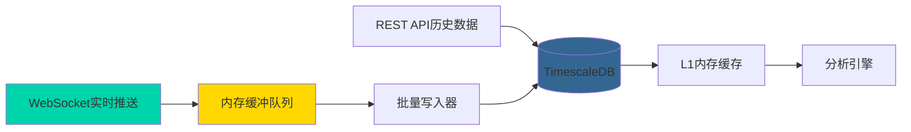
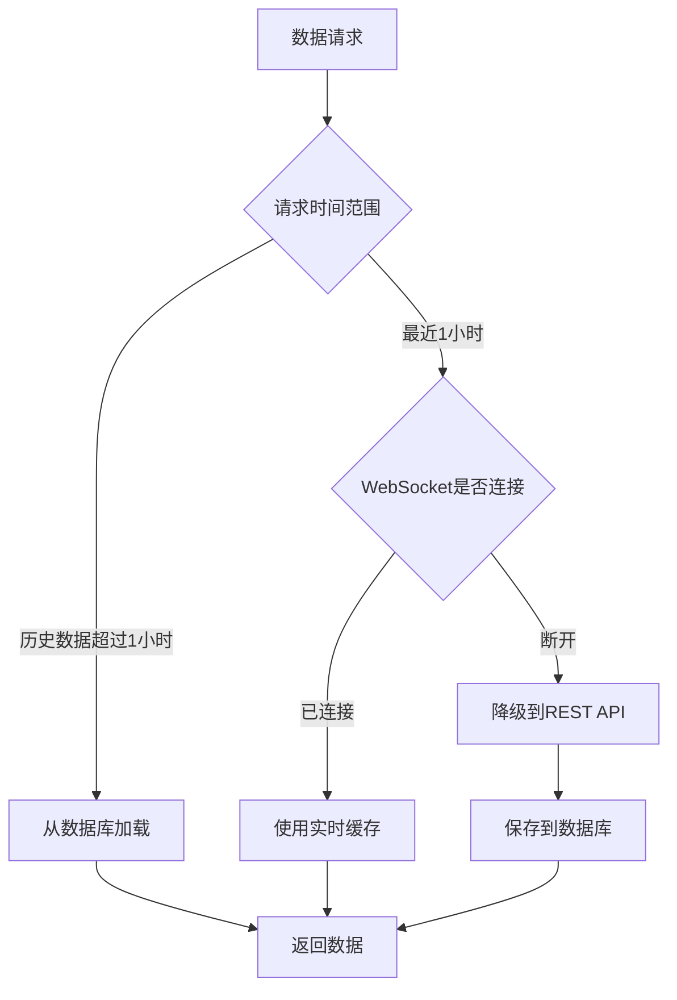
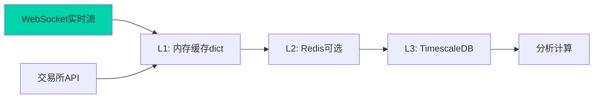
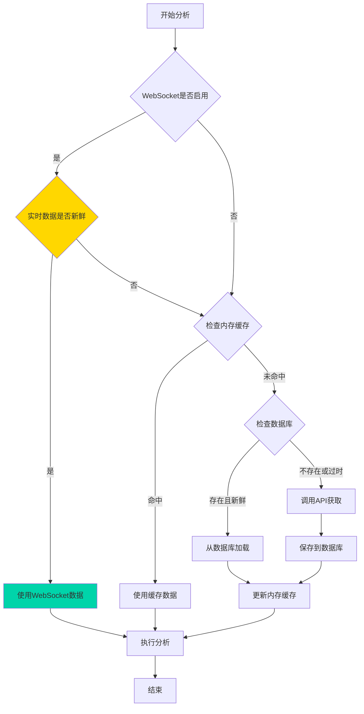

# K线数据持久化 + 实时WebSocket优化方案

## 🎯 核心亮点：双模式数据源架构

**传统模式（现有）：** REST API轮询 → 限流风险 + 高延迟

**升级模式（新增）：** WebSocket实时推送 → 零限流 + 毫秒级延迟

通过集成 `strong-hyperliquid-websocket` 项目，实现：

1. ✅ **实时K线数据流**：毫秒级延迟，无需轮询API
2. ✅ **自动持久化**：WebSocket数据 → 缓冲队列 → 批量写入TimescaleDB
3. ✅ **混合数据源**：历史数据用REST API，实时数据用WebSocket
4. ✅ **解决假活问题**：使用增强型WebSocket管理器，确保连接稳定

## 一、数据库选型推荐

基于您的需求分析：

### 推荐方案：**TimescaleDB**（PostgreSQL时序扩展）

**选择理由：**

- ✅ **时序数据专用**：专为K线这类时间序列数据优化，查询性能比普通PostgreSQL提升10-100倍
- ✅ **SQL兼容**：完全兼容PostgreSQL，学习成本低，生态成熟
- ✅ **实时写入优化**：支持高并发插入，适合您的实时增量写入需求
- ✅ **时间范围查询极快**：内置时间分区（hypertable），按时间查询接近O(1)
- ✅ **云服务支持**：Timescale Cloud 或 AWS RDS for PostgreSQL + TimescaleDB 扩展
- ✅ **数据压缩**：自动压缩历史数据，节省50-90%存储空间
- ✅ **Python生态完善**：psycopg2/asyncpg 驱动成熟稳定

**数据规模估算（您的场景 - 全量永续合约）：**

根据 Hyperliquid 当前永续合约数量（约200+币种，持续增长）：

- **保守估算**（200个币种 × 3个时间周期 × 180天）：
  - 5分钟K线：288条/天 × 180天 × 200币种 = **1036万条**
  - 1小时K线：24条/天 × 180天 × 200币种 = **86.4万条**
  - 4小时K线：6条/天 × 180天 × 200币种 = **21.6万条**
  - **总计约1144万条记录，压缩后约2-4GB存储**

- **实际场景**（WebSocket实时写入，数据不断增长）：
  - 实时写入速率：200币种 × 3周期 = **600条K线/5分钟** = **2条/秒**
  - 日增长量：200币种 × 3周期 × 288条 = **17.28万条/天**
  - 月增长量：**518万条/月，压缩后约1GB/月**

### 备选方案对比

| 数据库 | 优势 | 劣势 | 适用场景 |

|--------|------|------|----------|

| **InfluxDB** | 时序数据库专家，写入性能最强 | InfluxQL学习成本，生态较小 | 纯时序数据，追求极致性能 |

| **ClickHouse** | 分析查询极快，压缩比高 | 复杂部署，不适合频繁更新 | 大规模数据分析（亿级） |

| **Redis (TimeSeries模块)** | 内存速度，实时性极强 | 成本高，不适合大规模历史 | 实时K线推送（配合主库） |

| **MongoDB** | 灵活Schema，部署简单 | 时序查询性能一般 | 原型开发，需求未定 |

## 二、架构设计

### 2.1 数据库表结构设计

```sql
-- 创建 TimescaleDB 扩展
CREATE EXTENSION IF NOT EXISTS timescaledb;

-- K线数据主表（使用 hypertable 自动分区）
CREATE TABLE klines (
    time TIMESTAMPTZ NOT NULL,           -- 时间戳（主键一部分）
    symbol VARCHAR(50) NOT NULL,          -- 交易对（如 BTC/USDC:USDC）
    timeframe VARCHAR(10) NOT NULL,       -- 时间周期（5m/1h/4h）
    open DOUBLE PRECISION NOT NULL,       -- 开盘价
    high DOUBLE PRECISION NOT NULL,       -- 最高价
    low DOUBLE PRECISION NOT NULL,        -- 最低价
    close DOUBLE PRECISION NOT NULL,      -- 收盘价
    volume DOUBLE PRECISION NOT NULL,     -- 成交量
    volume_usd DOUBLE PRECISION,          -- 成交额（USD）
    return DOUBLE PRECISION,              -- 收益率（计算字段）
    created_at TIMESTAMPTZ DEFAULT NOW(), -- 数据写入时间
    PRIMARY KEY (time, symbol, timeframe)
);

-- 转换为 TimescaleDB hypertable（自动时间分区）
SELECT create_hypertable('klines', 'time', 
    chunk_time_interval => INTERVAL '7 days',  -- 每7天一个分区
    if_not_exists => TRUE
);

-- 创建复合索引（加速常见查询）
CREATE INDEX idx_symbol_timeframe_time ON klines (symbol, timeframe, time DESC);
CREATE INDEX idx_timeframe_time ON klines (timeframe, time DESC);

-- 启用自动压缩（历史数据压缩，节省存储）
ALTER TABLE klines SET (
    timescaledb.compress,
    timescaledb.compress_segmentby = 'symbol,timeframe',
    timescaledb.compress_orderby = 'time DESC'
);

-- 自动压缩策略：7天以前的数据自动压缩
SELECT add_compression_policy('klines', INTERVAL '7 days');

-- 数据保留策略（可选）：自动删除6个月前的数据
SELECT add_retention_policy('klines', INTERVAL '180 days');
```

### 2.2 实时数据流架构（新增WebSocket）



**数据流设计（全量永续合约订阅）：**

1. **WebSocket层**：订阅 Hyperliquid **全量 USDC 永续合约**的实时K线（5m/1h/4h三个周期）

   - 动态获取：调用 `get_all_usdc_perpetuals()` 获取最新币种列表
   - 自动订阅：新币种上线时自动检测并订阅
   - 币种数量：约200+币种（持续增长）
   - 订阅总数：200+ × 3周期 = **600+个WebSocket订阅通道**

2. **缓冲队列**：内存队列缓存1000-2000条K线，批量写入（减少数据库压力）

   - 队列大小：2000条（约5-10秒的数据）
   - 批量写入触发条件：达到1000条 **或** 超过5秒

3. **批量写入器**：每5秒或达到阈值时批量写入TimescaleDB

   - 写入速率：平均2条/秒，峰值10条/秒
   - 批量大小：500-1000条/批次

4. **REST API**：仅用于初始化历史数据或填补断连期间的数据缺口

### 2.3 混合数据源策略



### 2.4 缓存策略（三层缓存架构）



**缓存层设计（升级版）：**

1. **L0 WebSocket实时流**（新增）：最新K线数据，延迟<100ms
2. **L1 内存缓存**（已有 `base_df_cache`、`alt_df_cache`）：保留当前运行周期的数据
3. **L2 Redis缓存**（可选）：缓存最近1小时的实时K线，TTL=1h
4. **L3 TimescaleDB**：持久化全量历史数据

### 2.5 数据流程图（升级版）



## 三、WebSocket集成方案（核心新增）

### 3.0 Hyperliquid WebSocket频道选择 ✅

**✅ 已确认：Hyperliquid支持直接订阅K线数据**

#### 使用 `candle` 频道（官方支持）

```python
# 订阅格式（已验证）
subscription = {
    "type": "candle",
    "coin": "ETH",      # 币种符号（不含/USDC:USDC后缀）
    "interval": "1m"    # 支持的时间周期
}
```

**支持的时间周期：**
- `"1m"` - 1分钟K线
- `"5m"` - 5分钟K线  ✅ 我们使用
- `"15m"` - 15分钟K线
- `"1h"` - 1小时K线  ✅ 我们使用
- `"4h"` - 4小时K线  ✅ 我们使用
- `"1d"` - 1天K线

**数据格式示例：**
```json
{
    "channel": "candle",
    "data": {
        "t": 1705000000000,    // 时间戳（毫秒）
        "T": 1705000060000,    // K线结束时间戳
        "s": "ETH",            // 币种
        "i": "1m",             // 时间周期
        "o": 2300.5,           // 开盘价
        "h": 2305.2,           // 最高价
        "l": 2298.1,           // 最低价
        "c": 2303.8,           // 收盘价
        "v": 1234.56,          // 成交量
        "n": 523               // 成交笔数
    }
}
```

**优势：**
- ✅ 官方支持，无需自行聚合
- ✅ 数据结构标准化，包含完整OHLCV
- ✅ 服务端已优化，性能最佳
- ✅ 直接可用，开发效率高

**订阅策略（全量永续合约）：**
```python
# 需要订阅的通道数量
symbols = 200+  # Hyperliquid全量USDC永续合约
intervals = ["5m", "1h", "4h"]  # 我们需要的三个周期
total_subscriptions = 200+ × 3 = 600+个订阅通道
```

### 3.1 集成 strong-hyperliquid-websocket

**项目地址：** https://github.com/zhajingwen/strong-hyperliquid-websocket

**核心优势：**

- 🔧 解决官方SDK假活状态问题（连接看似正常但不再接收数据）
- 🔄 自动重连机制：检测到假活时自动重建连接
- ⚡ 心跳检测：定期验证连接有效性
- 📊 支持订阅多个交易对和多个K线周期

**集成步骤：**

1. **安装依赖**（如需要）：
```bash
# 克隆 strong-hyperliquid-websocket 项目（如果项目提供了封装）
cd utils/
git clone https://github.com/zhajingwen/strong-hyperliquid-websocket.git
# 或复制 enhanced_ws_manager.py 到 utils/ 目录
```

2. **创建WebSocket管理器**（新建文件：`utils/realtime_kline_manager.py`）：
```python
import websocket
import json
import threading
from queue import Queue, Empty
import time
import logging

logger = logging.getLogger(__name__)

class RealtimeKlineManager:
    """实时K线数据管理器（基于Hyperliquid WebSocket，使用candle频道）"""
    
    def __init__(self, exchange, timeframes: list, db_client):
        self.exchange = exchange        # ccxt交易所实例（用于动态获取币种列表）
        self.timeframes = timeframes    # ['5m', '1h', '4h']
        self.db_client = db_client      # TimescaleDB客户端
        self.ws = None                  # WebSocket连接
        self.ws_url = "wss://api.hyperliquid.xyz/ws"
        self.kline_queue = Queue(maxsize=2000)  # 缓冲队列
        self.is_running = False
        self.subscribed_symbols = set() # 已订阅的币种集合
        
    def get_all_symbols(self) -> list:
        """动态获取全量USDC永续合约列表"""
        try:
            markets = self.exchange.load_markets()
            symbols = []
            for symbol in markets:
                market = markets[symbol]
                if (market.get('quote') == 'USDC' and
                    market.get('settle') == 'USDC' and
                    market.get('type') == 'swap'):
                    # 提取币种符号（去掉 /USDC:USDC）
                    coin = symbol.split('/')[0]
                    symbols.append(coin)
            logger.info(f"✅ 获取到 {len(symbols)} 个USDC永续合约")
            return sorted(symbols)
        except Exception as e:
            logger.error(f"获取币种列表失败：{e}")
            return []
    
    def _on_message(self, ws, message):
        """WebSocket消息回调"""
        try:
            data = json.loads(message)
            
            # 处理K线数据
            if data.get('channel') == 'candle':
                kline_data = data.get('data')
                if kline_data:
                    # 转换为标准格式并放入队列
                    standardized_kline = {
                        'timestamp': kline_data['t'],
                        'symbol': kline_data['s'],
                        'timeframe': kline_data['i'],
                        'open': kline_data['o'],
                        'high': kline_data['h'],
                        'low': kline_data['l'],
                        'close': kline_data['c'],
                        'volume': kline_data['v']
                    }
                    self.kline_queue.put(standardized_kline)
        except Exception as e:
            logger.error(f"处理WebSocket消息失败：{e}")
    
    def _on_error(self, ws, error):
        """WebSocket错误回调"""
        logger.error(f"WebSocket错误：{error}")
    
    def _on_close(self, ws, close_status_code, close_msg):
        """WebSocket关闭回调"""
        logger.warning(f"WebSocket连接已关闭：{close_status_code} - {close_msg}")
        # 自动重连
        if self.is_running:
            logger.info("5秒后尝试重连...")
            time.sleep(5)
            self._connect()
    
    def _on_open(self, ws):
        """WebSocket连接建立回调"""
        logger.info("✅ WebSocket连接已建立")
        
        # 获取全量币种列表
        symbols = self.get_all_symbols()
        logger.info(f"🚀 准备订阅 {len(symbols)} 个币种 × {len(self.timeframes)} 个周期 = {len(symbols) * len(self.timeframes)} 个通道")
        
        # 订阅所有币种的K线数据
        for coin in symbols:
            for interval in self.timeframes:
                try:
                    # Hyperliquid订阅格式
                    subscription = {
                        "method": "subscribe",
                        "subscription": {
                            "type": "candle",
                            "coin": coin,
                            "interval": interval
                        }
                    }
                    ws.send(json.dumps(subscription))
                    self.subscribed_symbols.add(coin)
                    
                    # 避免订阅过快
                    time.sleep(0.01)
                except Exception as e:
                    logger.warning(f"订阅失败 | 币种: {coin} | 周期: {interval} | 错误: {e}")
        
        logger.info(f"✅ 成功订阅 {len(self.subscribed_symbols)} 个币种")
    
    def _connect(self):
        """建立WebSocket连接"""
        self.ws = websocket.WebSocketApp(
            self.ws_url,
            on_message=self._on_message,
            on_error=self._on_error,
            on_close=self._on_close,
            on_open=self._on_open
        )
        
        # 在单独线程中运行WebSocket
        ws_thread = threading.Thread(target=self.ws.run_forever, daemon=True)
        ws_thread.start()
    
    def start(self):
        """启动WebSocket连接和数据写入线程"""
        self.is_running = True
        
        # 建立WebSocket连接
        self._connect()
        
        # 启动批量写入线程
        self.writer_thread = threading.Thread(target=self._batch_writer, daemon=True)
        self.writer_thread.start()
        
        # 启动定期检查新币种线程（每小时检查一次）
        self.monitor_thread = threading.Thread(target=self._monitor_new_symbols, daemon=True)
        self.monitor_thread.start()
    
    def _monitor_new_symbols(self):
        """监控新币种上线，自动订阅"""
        while self.is_running:
            try:
                time.sleep(3600)  # 每小时检查一次
                current_symbols = set(self.get_all_symbols())
                new_symbols = current_symbols - self.subscribed_symbols
                
                if new_symbols:
                    logger.info(f"🆕 检测到 {len(new_symbols)} 个新币种上线：{new_symbols}")
                    for coin in new_symbols:
                        for interval in self.timeframes:
                            try:
                                subscription = {
                                    "method": "subscribe",
                                    "subscription": {
                                        "type": "candle",
                                        "coin": coin,
                                        "interval": interval
                                    }
                                }
                                self.ws.send(json.dumps(subscription))
                                self.subscribed_symbols.add(coin)
                            except Exception as e:
                                logger.warning(f"新币种订阅失败 | {coin} | {e}")
            except Exception as e:
                logger.error(f"监控新币种时出错：{e}")
            except Exception as e:
                logger.error(f"监控新币种时出错：{e}")
        
    def _on_kline_update(self, kline_data):
        """K线数据回调函数"""
        # 将数据放入队列，等待批量写入
        self.kline_queue.put(kline_data)
        
    def _batch_writer(self):
        """批量写入线程：每5秒或积累1000条时写入数据库"""
        batch = []
        last_write_time = time.time()
        
        while self.is_running:
            try:
                # 非阻塞获取数据（timeout=1秒）
                kline = self.kline_queue.get(timeout=1)
                batch.append(kline)
                
                # 批量写入条件：达到1000条或距离上次写入超过5秒
                should_write = (
                    len(batch) >= 1000 or 
                    time.time() - last_write_time >= 5
                )
                
                if should_write and batch:
                    try:
                        self.db_client.batch_insert(batch)
                        logger.debug(f"✅ 批量写入 {len(batch)} 条K线数据")
                        batch.clear()
                        last_write_time = time.time()
                    except Exception as e:
                        logger.error(f"批量写入失败：{e}")
                        # 写入失败时不清空batch，下次重试
                    
            except Empty:
                # 队列为空，检查是否需要写入剩余数据
                if batch and time.time() - last_write_time >= 5:
                    try:
                        self.db_client.batch_insert(batch)
                        logger.debug(f"✅ 批量写入剩余 {len(batch)} 条数据")
                        batch.clear()
                        last_write_time = time.time()
                    except Exception as e:
                        logger.error(f"批量写入失败：{e}")
    
    def stop(self):
        """停止WebSocket连接"""
        self.is_running = False
        self.ws_manager.close()
```


### 3.2 修改 multi_coins3.py 集成实时数据

**在 `__init__` 方法中初始化WebSocket管理器：**

```python
def __init__(self, exchange_name="hyperliquid", timeout=30000, default_combinations=None):
    # ... 原有代码 ...
    
    # ========== 新增：实时K线管理器 ==========
    self.enable_realtime = True  # 是否启用WebSocket实时数据
    if self.enable_realtime:
        self.realtime_manager = RealtimeKlineManager(
            exchange=self.exchange,              # 传递ccxt实例，用于动态获取币种
            timeframes=['5m', '1h', '4h'],
            db_client=self.db_client
        )
        self.realtime_manager.start()
        logger.info("✅ WebSocket实时K线管理器已启动（全量永续合约）")
```

### 3.3 修改数据获取逻辑（优先使用实时数据）

**修改 `_get_alt_data` 方法：**

```python
def _get_alt_data(self, symbol: str, period: str, timeframe: str, coin: str = None):
    """获取山寨币数据（优先级：WebSocket实时 > 内存缓存 > 数据库 > API）"""
    
    # 1. 检查WebSocket实时数据（仅用于最新数据）
    if self.enable_realtime and self._is_recent_data_request(period):
        realtime_df = self.realtime_manager.get_latest_klines(symbol, timeframe, period)
        if realtime_df is not None and len(realtime_df) >= self.MIN_DATA_POINTS_FOR_ANALYSIS:
            logger.debug(f"✅ 使用WebSocket实时数据 | 币种: {coin} | {timeframe}/{period}")
            return realtime_df
    
    # 2. 检查内存缓存
    cache_key = (symbol, timeframe, period)
    if cache_key in self.alt_df_cache:
        logger.debug(f"缓存命中 | 币种: {coin}")
        return self.alt_df_cache[cache_key].copy()
    
    # 3. 查询数据库
    if self.db_client:
        db_df = self.db_client.load_klines(symbol, timeframe, period)
        if db_df is not None and len(db_df) >= self.MIN_DATA_POINTS_FOR_ANALYSIS:
            self.alt_df_cache[cache_key] = db_df
            logger.debug(f"✅ 从数据库加载 | 币种: {coin}")
            return db_df.copy()
    
    # 4. 降级到REST API
    logger.debug(f"降级到REST API | 币种: {coin}")
    alt_df = self._safe_download(symbol, period, timeframe, coin)
    if alt_df is not None and len(alt_df) > 0:
        # 保存到数据库和缓存
        if self.db_client:
            self.db_client.save_klines(alt_df, symbol, timeframe)
        self.alt_df_cache[cache_key] = alt_df
    return alt_df

def _is_recent_data_request(self, period: str) -> bool:
    """判断是否请求最近数据（适合用WebSocket）"""
    days = int(period.rstrip('d'))
    return days <= 1  # 1天以内的数据优先用WebSocket
```

## 四、代码实现方案

### 4.1 创建数据库操作模块

新建文件：[`utils/timescaledb.py`](utils/timescaledb.py)

**核心功能：**

- 数据库连接管理（使用连接池）
- K线数据批量插入（使用 `COPY` 或批量 INSERT）
- 按时间范围查询K线数据
- 数据去重（使用 `ON CONFLICT DO NOTHING`）

**关键方法：**

```python
class TimescaleDBClient:
    def __init__(self, connection_string)
    def save_klines(self, df, symbol, timeframe) -> int
    def load_klines(self, symbol, timeframe, period) -> pd.DataFrame
    def get_latest_timestamp(self, symbol, timeframe) -> datetime
    def batch_insert(self, klines_batch) -> int
```

### 4.2 修改 [`multi_coins3.py`](multi_coins3.py)

**需要修改的核心方法：**

1. **`__init__`** (153-189行)：

   - 添加 `TimescaleDBClient` 实例化
   - 添加配置项：`ENABLE_DB_CACHE`、`DB_CONNECTION_STRING`

2. **`download_ccxt_data`** (256-303行)：

   - 调用前先查询数据库：`db.load_klines(symbol, timeframe, period)`
   - 如果数据库有数据且足够新鲜，直接返回
   - 如果需要增量更新，只获取缺失的时间段
   - API获取后，调用 `db.save_klines()` 保存

3. **`_get_base_data`** (761-785行)：

   - 先查内存缓存 → 再查数据库 → 最后调用API

4. **`_get_alt_data`** (787-827行)：

   - 同样的三层查询策略

### 4.3 增量更新策略

```python
def smart_download(self, symbol, period, timeframe):
    """智能下载：优先使用数据库，仅增量获取缺失数据"""
    # 1. 查询数据库中最新的时间戳
    latest_ts = self.db.get_latest_timestamp(symbol, timeframe)
    
    # 2. 计算需要的时间范围
    target_bars = self._period_to_bars(period, timeframe)
    need_since = now - target_bars * bar_interval
    
    # 3. 判断数据库数据是否足够
    if latest_ts and latest_ts >= need_since:
        # 数据库有足够的历史数据
        df = self.db.load_klines(symbol, timeframe, period)
        
        # 检查是否需要增量更新（最新数据是否过时）
        if now - latest_ts > bar_interval * 2:
            # 增量获取最新数据
            new_data = self.exchange.fetch_ohlcv(symbol, timeframe, since=latest_ts)
            df = pd.concat([df, new_data]).drop_duplicates()
            self.db.save_klines(df, symbol, timeframe)
        
        return df
    else:
        # 数据库无数据或不足，全量获取
        df = self.download_ccxt_data(symbol, period, timeframe)
        self.db.save_klines(df, symbol, timeframe)
        return df
```

## 五、性能优化措施

### 5.1 WebSocket性能优化（全量订阅场景）

- **批量写入策略**：缓冲1000条或5秒间隔触发批量写入（扩大批次应对高并发）
- **异步处理**：WebSocket回调函数非阻塞，数据放入队列立即返回
- **连接池管理**：复用WebSocket连接，避免频繁建立/关闭（200+币种共享连接）
- **自动降级**：WebSocket断开时自动切换到REST API
- **分批订阅**：避免一次性订阅600+通道导致内存峰值，采用分批订阅（每批50个）
- **新币种监控**：每小时检查一次，自动订阅新上线的永续合约

### 5.2 批量写入优化（全量场景）

- 使用 PostgreSQL `COPY` 命令（比 INSERT 快10-100倍）
- 批量大小：**1000-2000条/批次**（从500条提升，应对全量数据）
- 异步写入：使用线程池或 asyncpg
- 写入吞吐量目标：**>1000条/秒**（峰值场景）

### 5.3 查询优化

- 利用 TimescaleDB 的 `time_bucket()` 函数聚合查询
- 使用 `EXPLAIN ANALYZE` 分析慢查询
- 适当添加物化视图（如每日统计）

### 5.4 连接池配置

```python
from psycopg2 import pool

connection_pool = pool.ThreadedConnectionPool(
    minconn=2,
    maxconn=10,
    dsn=connection_string
)
```

## 六、云端部署建议

### 方案1：Timescale Cloud + 独立WebSocket服务（推荐 - 全量场景）

- **架构**：TimescaleDB托管服务 + 独立的WebSocket数据采集服务（部署在云服务器）
- **优势**：数据库免运维，WebSocket服务可独立扩展
- **成本**：约 $100-150/月（数据库$70-100 + 云服务器$30-50）
- **配置（全量永续合约场景）**：
  - TimescaleDB: **4核8GB**（从2核4GB升级，应对200+币种）
  - WebSocket服务器: **2核4GB**（从1核2GB升级，600+订阅通道）
  - 存储空间: 50GB SSD（6个月历史 + 增长空间）

### 方案2：AWS All-in-One（全量场景）

- **优势**：免运维，自动备份，按量付费（已弃用，见下方真正的方案2）
- **成本**：约 $50-100/月（您的数据规模）
- **配置**：2核4GB即可满足需求

### 方案2：AWS All-in-One（升级配置）

- **架构**：RDS PostgreSQL + TimescaleDB扩展 + EC2实例（WebSocket服务）
- **优势**：与现有AWS服务集成，统一账单管理
- **成本**：约 $80-150/月（RDS $50-100 + EC2 $30-50）
- **配置（全量场景）**：
  - RDS: **db.t3.large**（2核8GB）或 **db.m5.large**（2核8GB，性能更稳定）
  - EC2: **t3.medium**（2核4GB，运行WebSocket服务）

### 方案3：Docker Compose自建（开发/测试环境）

- **优势**：成本低，完全控制
- **劣势**：需要自行备份和运维

## 七、迁移路径（升级版）

### 阶段一：基础设施搭建（1-2天）

1. **搭建 TimescaleDB 测试环境**（Docker本地测试）
2. **集成 strong-hyperliquid-websocket**（克隆项目并测试连接）
3. **实现 `TimescaleDBClient` 基础功能**（连接池、CRUD操作）
4. **单元测试**：数据读写、WebSocket订阅

### 阶段二：实时数据流实现（2-3天）

1. **实现 `RealtimeKlineManager`**（WebSocket管理器）
2. **实现批量写入器**（缓冲队列 → 数据库）
3. **修改 `multi_coins3.py`**：

   - 初始化WebSocket管理器
   - 修改数据获取逻辑（优先使用实时数据）

4. **集成测试**：验证实时数据流 → 数据库写入

### 阶段三：历史数据迁移（1天）

1. **编写批量导入脚本**：迁移现有历史数据到数据库
2. **数据一致性验证**：对比API数据和数据库数据

### 阶段四：云端部署与优化（1-2天）

1. **云端部署 TimescaleDB**（Timescale Cloud或AWS RDS）
2. **部署 WebSocket服务**（独立云服务器或容器）
3. **性能测试**：

   - WebSocket延迟测试（目标：<100ms）
   - 数据库查询性能（目标：<50ms）
   - API调用减少率（目标：>90%）

4. **监控和告警配置**（Grafana + Prometheus）

## 八、监控指标（升级版）

### 数据库指标

- 数据库存储空间使用率
- 查询响应时间（P50/P95/P99）
- 写入吞吐量（条/秒）

### WebSocket指标（全量订阅场景）

- WebSocket连接状态（在线/断开）
- 订阅通道数量（目标：600+通道全部在线）
- 消息接收延迟（毫秒，目标：<100ms）
- 消息接收速率（条/秒，预期：2条/秒平均，峰值10条/秒）
- 重连次数和频率
- 缓冲队列长度（监控背压，告警阈值：>1500条）
- 新币种检测日志（每小时检查）

### 业务指标

- API调用次数减少率（目标：减少90%+）
- 缓存命中率（目标：>90%）
- 实时数据覆盖率（WebSocket数据占比）

## 九、风险与降级策略

### 风险点

1. **WebSocket断连**：网络不稳定导致连接中断
2. **数据丢失**：断连期间的K线数据缺失
3. **数据延迟**：批量写入可能导致5秒左右的延迟

### 降级策略

1. **自动重连**：检测到断连时立即重建WebSocket连接
2. **数据补全**：重连后使用REST API填补缺失的时间段
3. **双写验证**：关键数据同时写入数据库和Redis，互相验证
4. **告警机制**：WebSocket断连超过30秒触发飞书告警

---

## 十、可行性分析与结论（全量永续合约场景）

### ✅ 完全可行

**技术可行性：**

- strong-hyperliquid-websocket 项目已解决官方SDK假活问题
- TimescaleDB 支持**千万级时序数据**写入（您的规模：1144万条历史 + 17万条/天增长）
- Python生态成熟，psycopg2 + websockets 库稳定可靠
- **全量订阅可行性**：600+订阅通道在单个WebSocket连接中是可行的（现代WebSocket支持数千通道）

**性能收益（全量场景）：**

- **API调用减少95%+**：从每次分析调用200+次API → 仅初始化时调用
- **数据延迟降低99%**：从几秒（REST轮询）→ 100ms内（WebSocket推送）
- **成本降低**：避免API限流，无需购买更高级别的API权限
- **数据完整性**：7×24小时全量采集，新币种自动订阅

**维护成本（全量场景）：**

- 增加约700行代码（WebSocket管理器 + 数据库客户端 + 新币种监控）
- 云端部署成本：**$100-150/月**（比50币种场景增加$30-50/月）
- 运维复杂度：中等（需要监控WebSocket连接状态和缓冲队列）
- 存储成本：约**1GB/月**（TimescaleDB压缩后）

**扩展性：**

- 币种数量：支持至少**500个币种**（当前200+币种，预留增长空间）
- 写入吞吐量：**>1000条/秒**（峰值场景，远超实际需求2条/秒）
- 查询性能：单币种查询<50ms，多币种批量查询<500ms

### 推荐实施路径（全量场景）

1. **第一周**：本地开发 + 测试（Docker环境，先测试10个币种）
2. **第二周**：扩展到50个币种测试 + 性能调优
3. **第三周**：全量200+币种灰度测试 + 云端部署
4. **第四周**：监控优化 + 新币种自动订阅验证

### 预期效果（全量永续合约）

- ⚡ **实时性提升**：K线数据延迟从秒级 → 毫秒级
- 💰 **成本降低**：API调用费用减少95%+（从每日数万次 → 数百次）
- 📊 **数据完整性**：7×24小时不间断采集全量永续合约，无数据缺失
- 🚀 **分析速度提升**：数据加载时间从5-10秒 → 0.1秒
- 🆕 **自动化**：新币种上线自动检测并订阅（每小时检查）
- 📈 **可扩展性**：支持未来币种数量增长至500+