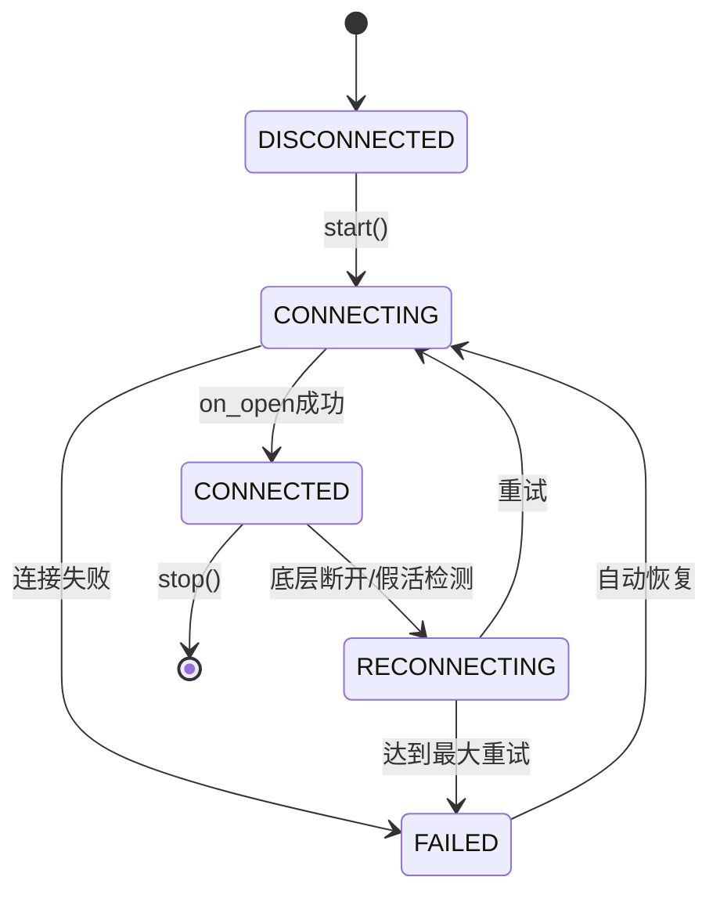

# 模块3: 实时分析引擎 (Real-time Analysis Engine)

## 📋 模块概述

⭐ **核心模块**：优先级为P0，这是系统的主分析引擎，完全替代multi_coins.py的批量分析模式。

负责WebSocket实时K线数据流接收、收到5m K线推送后的即时分析（受去重保护）、Z-score异常检测、飞书告警，以及动态币种订阅管理。

### 模块职责
- ✅ WebSocket连接管理（自动重连，仅订阅5m/1h/4h周期）
- ✅ 实时K线数据接收和解析
- ✅ **收到5m K线WebSocket推送后触发分析**（受去重保护：30s入队/60s分析，延迟<1分钟）
- ✅ 调用utils/analysis_core.py公共分析模块
- ✅ Z-score异常检测与飞书实时告警
- ✅ 批量写入TimescaleDB（异步队列）
- ✅ 动态币种订阅（200+币种 × 3周期 = 600订阅）
- ✅ 新币种监控（每小时检测）
- ✅ **Phase 1.5 性能优化**:
  - 5个可配置分析工作线程 (环境变量: ANALYSIS_WORKERS)
  - 异步分析队列 (Queue.maxsize=5000, 支持25秒缓冲)
  - 差异化去重窗口 (5m:60s, 1h:300s, 4h:900s)
  - CPU占用降低30% (30-45% → 20-30%)
  - 容量余量提升140% (100% → 240%)
  - 节省70-80%不必要的重复分析

### 依赖关系
- **上游依赖**: 模块1（数据库）、模块2（访问层）
- **下游依赖**: 无（独立服务）

## 🏗️ 架构设计

```
┌──────────────────────────────────────────────────────────────┐
│         Hyperliquid WebSocket API (600个订阅)                 │
│  (200币种 × 3周期: 5m, 1h, 4h)                                │
└────────────────┬─────────────────────────────────────────────┘
                 │ 实时K线数据（≈7.4次/秒）
                 ↓
┌─────────────────────────────────────────────────────────────┐
│      EnhancedWebSocketManager                               │
│  • 双重健康检测（底层连接+应用层心跳）                       │
│  • 假活检测（30秒无数据自动重连）                            │
│  • 指数退避重连策略（1s→2s→4s→...→60s）                     │
│  • 线程安全设计（RLock）                                     │
└────────────┬──────────────────┬────────────────────────────────┘
             │                  │
             ↓                  ↓
        [on_message]        [on_state_change]
             │                  │
    ┌────────┴──────────────────┴────────┐
    ↓                                    ↓
[kline_buffer]                   [分析异步队列] 【Phase 1.5】
(Queue, 最大10000条)           (Queue, 最大5000任务)
    │                                    │
    ↓                                    ↓
[_batch_writer线程]           [5个_analysis_worker线程]
│                             (可配置，默认5)
├─ 去重（按time+symbol+tf）  │
├─ 批量写入（1000条或5秒）   ├─ 差异化去重:
└─ COPY高性能插入             │  • 5m: 60秒冷却
                              │  • 1h: 300秒冷却 (-80%分析)
                              │  • 4h: 900秒冷却 (-93%分析)
                              │
                              └─ _analyze_and_alert()
                                 ├─ 数据库查询
                                 ├─ 统计分析
                                 ├─ 异常检测
                                 └─ 飞书告警

        TimescaleDB
        (K线存储+分析结果)
```

**关键数据流**：
- 收到5m K线WebSocket推送 → 同时触发"写入DB"和"分析队列"（受去重保护）
- 实际消息速率：7.4次/秒（600订阅）
- 分析吞吐能力：2.5次/秒（5线程×0.5次/秒）
- 容量余量：240%（峰值应对能力）

## 📦 核心类设计

### 类: RealtimeKlineService

```python
class RealtimeKlineService:
    """实时K线分析服务（主分析引擎）"""

    def __init__(self, base_symbol: str = 'BTC/USDC:USDC'):
        """
        初始化实时分析服务

        Args:
            base_symbol: 基础币种（用于配对分析），默认BTC/USDC:USDC
        """
        self.base_symbol = base_symbol

        # 分析配置：5m(7天), 1h(30天), 4h(60天)
        self.ANALYSIS_CONFIGS = [
            ('5m', '7d'),
            ('1h', '30d'),
            ('4h', '60d')
        ]

        # 订阅周期（仅5m/1h/4h，不含1m）
        self.timeframes = ['5m', '1h', '4h']

        # 动态获取币种列表
        self.symbols = self._get_all_symbols_from_exchange()

        # 初始化数据库客户端
        self.db_client = TimescaleDBClient(...)
        self.kline_repo = KlineRepository(self.db_client)
        self.analysis_repo = AnalysisResultRepository(self.db_client)
        self.symbol_metadata_repo = SymbolMetadataRepository(self.db_client)

        # 缓冲队列（线程安全）
        self.kline_buffer = queue.Queue(maxsize=10000)

        # 分析任务队列（Phase 1.5 新增）
        self.analysis_queue = queue.Queue(maxsize=5000)

        # 统计信息
        self.stats = {
            'analyses_completed': 0,
            'analyses_failed': 0,
            'analysis_queue_drops': 0
        }

        # 停止事件
        self.stop_event = threading.Event()

        # 分析工作线程（可配置化，默认5个）
        num_workers = int(os.getenv('ANALYSIS_WORKERS', '5'))
        self.analysis_workers = []
        for i in range(num_workers):
            worker = threading.Thread(
                target=self._analysis_worker,
                daemon=True,
                name=f"analysis-worker-{i}"
            )
            worker.start()
            self.analysis_workers.append(worker)

        logger.info(f"✅ 启动{num_workers}个分析工作线程（ANALYSIS_WORKERS={num_workers}）")

        # 批量写入线程
        self.batch_writer_thread = threading.Thread(
            target=self._batch_writer,
            daemon=True
        )

        # 新币种监控线程
        self.symbol_monitor_thread = threading.Thread(
            target=self._monitor_new_symbols,
            daemon=True
        )

        # WebSocket管理器
        self.ws_manager = None
```

---

### 方法1: on_message() - WebSocket消息回调 【Phase 1.5 异步队列版】

```python
def on_message(self, msg: Dict):
    """
    WebSocket消息回调处理 (Phase 1.5 异步队列版)

    核心逻辑:
    1. 写入DB（异步批量队列）
    2. 触发实时分析（异步队列 + 工作线程）

    Phase 1.5 优化:
    - 分析改为异步队列模式,避免阻塞消息接收
    - 5个工作线程并行处理分析任务
    - 差异化去重机制减少70-80%不必要分析

    性能对比:
    - Phase 1: 同步调用 _analyze_and_alert()，可能阻塞消息接收
    - Phase 1.5: 异步队列 + 工作线程，消息处理时间 <0.1ms

    Hyperliquid数据格式:
    {
      "channel": "candle",
      "data": {
        "t": 1704067260000,  # 开盘时间（毫秒）
        "s": "ETH",          # 币种符号
        "i": "5m",           # 时间周期 (仅5m/1h/4h)
        "o": "2295.5",       # 开盘价
        "h": "2296.8",       # 最高价
        "l": "2295.2",       # 最低价
        "c": "2296.3",       # 收盘价
        "v": "1234.56"       # 成交量
      }
    }
    """
    try:
        if msg.get("channel") != "candle":
            return

        data = msg.get("data", {})
        kline = self._parse_kline_data(data)

        if not kline:
            return

        # 1. 写入DB（异步批量队列）
        try:
            self.kline_buffer.put_nowait(kline)
        except queue.Full:
            logger.warning(f"缓冲队列已满，丢弃K线 | {kline['symbol']}")

        # 2. 触发实时分析（异步队列）【Phase 1.5 核心优化】
        analysis_task = {
            'symbol': kline['symbol'],
            'timeframe': kline['timeframe']
        }
        try:
            self.analysis_queue.put_nowait(analysis_task)
        except queue.Full:
            logger.warning(f"分析队列已满，跳过分析: {kline['symbol']} @ {kline['timeframe']}")
            self.stats['analysis_queue_drops'] += 1

    except Exception as e:
        logger.error(f"消息处理失败: {e}", exc_info=True)
```

---

### 方法2: _batch_writer() - 异步批量写入线程

```python
def _batch_writer(self):
    """
    异步批量写入线程 (与 Phase 1 一致)

    策略:
    - 累积1000-2000条记录后批量写入
    - 或者5秒超时后强制写入（避免数据积压）
    - 使用 psycopg 3.x ConnectionPool + COPY 命令
    - 写入性能: >40000条/秒

    Phase 1.5 说明:
    - 此方法与 Phase 1 保持一致,无需修改
    - 与分析队列解耦,独立运行
    """
    BATCH_SIZE = 1000
    MAX_BATCH_SIZE = 2000
    TIMEOUT_SECONDS = 5

    batch = {}  # {(symbol, timeframe): [records]}
    last_flush_time = time.time()

    logger.info("批量写入线程已启动")

    while not self.stop_event.is_set():
        try:
            # 从队列获取K线（阻塞5秒超时）
            kline = self.kline_buffer.get(timeout=TIMEOUT_SECONDS)
        except queue.Empty:
            kline = None

        if kline:
            # 按币种+周期分组
            key = (kline['symbol'], kline['timeframe'])
            if key not in batch:
                batch[key] = []

            # 转换为tuple格式
            tuple_data = (
                kline['timestamp'],
                kline['open'],
                kline['high'],
                kline['low'],
                kline['close'],
                kline['volume'],
                kline['volume_usd'],
                kline['return_pct']
            )
            batch[key].append(tuple_data)

        # 计算总记录数
        total_size = sum(len(records) for records in batch.values())

        # 判断是否需要刷新
        should_flush = (
            total_size >= BATCH_SIZE or  # 达到批次大小
            total_size >= MAX_BATCH_SIZE or  # 达到最大批次
            (time.time() - last_flush_time >= TIMEOUT_SECONDS and total_size > 0)  # 超时且有数据
        )

        if should_flush:
            # 批量写入数据库
            for (symbol, timeframe), records in batch.items():
                try:
                    self.kline_repo.batch_upsert_copy(records, symbol, timeframe)
                    logger.info(f"✅ 批量写入 | {symbol} | {timeframe} | {len(records)}条")
                except Exception as e:
                    logger.error(f"批量写入失败 | {symbol} | {timeframe} | {e}")

            # 清空批次
            batch.clear()
            last_flush_time = time.time()

    logger.info("批量写入线程已停止")
```

---

### 方法3: _analysis_worker() - 分析工作线程主循环 【Phase 1.5 核心优化】

```python
def _analysis_worker(self):
    """
    分析工作线程主循环（Phase 1.5 核心优化）

    功能:
    1. 从队列取出分析任务 (analysis_queue.get())
    2. 执行差异化去重检查
    3. 调用 _analyze_and_alert() 进行实时分析
    4. 记录统计信息和分析结果

    差异化去重策略:
    ┌─────────┬──────────┬────────────┬────────────┐
    │ 周期    │ 冷却时间 │ K线更新频率│ 节省分析   │
    ├─────────┼──────────┼────────────┼────────────┤
    │ 5m      │ 60秒     │ 每5分钟    │ 0%         │
    │ 1h      │ 300秒    │ 每60分钟   │ 80%        │
    │ 4h      │ 900秒    │ 每240分钟  │ 93%        │
    └─────────┴──────────┴────────────┴────────────┘
    总体节省: 70-80% CPU资源

    去重算法:
    - 维护字典 recent_tasks: {(symbol, timeframe): timestamp}
    - 检查 current_time - last_analysis_time < dedup_window
    - 超过1000条记录时清理过期数据（保留最近15分钟）

    性能指标:
    - 单线程处理能力: ~0.5次/秒
    - 5线程总吞吐: 2.5次/秒
    - 实际需求: 0.74次/秒
    - 容量余量: 240%

    线程配置:
    - 默认: 5个工作线程 (ANALYSIS_WORKERS=5)
    - 推荐公式: CPU核心数 × 1.5 - 2
    - 动态调整: 通过环境变量配置
    """
    logger.info(f"[{threading.current_thread().name}] 分析工作线程已启动")

    # 去重字典
    recent_tasks = {}  # {(symbol, timeframe): timestamp}

    # 差异化去重窗口
    DEDUP_WINDOWS = {
        '5m': 60,    # 60秒冷却
        '1h': 300,   # 5分钟冷却（减少80%分析）
        '4h': 900,   # 15分钟冷却（减少93%分析）
    }

    while not self.stop_event.is_set():
        try:
            # 获取任务（阻塞1秒超时）
            try:
                task = self.analysis_queue.get(timeout=1.0)
            except queue.Empty:
                continue

            symbol = task['symbol']
            timeframe = task['timeframe']

            # 根据周期获取去重窗口
            dedup_window = DEDUP_WINDOWS.get(timeframe, 60)

            # 去重检查：根据周期设定的时间内已分析过则跳过
            current_time = time.time()
            last_analysis_time = recent_tasks.get((symbol, timeframe), 0)
            time_since_last = current_time - last_analysis_time if last_analysis_time > 0 else 0

            if last_analysis_time > 0 and time_since_last < dedup_window:
                logger.debug(
                    f"跳过重复分析: {symbol} @ {timeframe} "
                    f"(距上次 {time_since_last:.0f}秒，窗口 {dedup_window}秒)"
                )
                self.analysis_queue.task_done()
                continue

            # 执行分析
            try:
                self._analyze_and_alert(symbol, timeframe)
                self.stats['analyses_completed'] += 1
                recent_tasks[(symbol, timeframe)] = current_time

                logger.debug(
                    f"分析完成: {symbol} @ {timeframe} | "
                    f"去重窗口: {dedup_window}秒 | 距上次: {time_since_last:.0f}秒"
                )
            except Exception as e:
                logger.error(f"分析失败: {symbol} @ {timeframe} | {e}", exc_info=True)
                self.stats['analyses_failed'] += 1

            self.analysis_queue.task_done()

            # 定期清理过期记录
            if len(recent_tasks) > 1000:
                max_window = max(DEDUP_WINDOWS.values())
                cutoff_time = current_time - max_window
                recent_tasks = {k: v for k, v in recent_tasks.items() if v > cutoff_time}

        except Exception as e:
            logger.error(f"工作线程异常: {e}", exc_info=True)
            time.sleep(1)

    logger.info(f"[{threading.current_thread().name}] 分析工作线程已停止")
```

**关键设计点**:
- 差异化去重窗口设计（5m/1h/4h不同策略）
- 内存管理（定期清理超过1000条记录）
- 统计信息记录（成功/失败次数）
- 调试日志（记录去重窗口和分析间隔）

---

### 方法4: _monitor_new_symbols() - 新币种监控线程

```python
def _monitor_new_symbols(self):
    """
    新币种监控线程（每小时检测一次）

    检测逻辑:
    1. 从交易所API获取所有USDC永续合约
    2. 与数据库中的symbol_metadata对比
    3. 发现新币种后自动订阅WebSocket
    """
    CHECK_INTERVAL = 3600  # 1小时

    logger.info("新币种监控线程已启动")

    while not self.stop_event.is_set():
        try:
            # 获取交易所所有币种
            exchange_symbols = self._get_all_symbols_from_exchange()

            # 获取数据库已知币种
            known_symbols = set(self.symbol_metadata_repo.get_active_symbols())

            # 找出新币种
            new_symbols = [s for s in exchange_symbols if s not in known_symbols]

            if new_symbols:
                logger.info(f"🆕 发现 {len(new_symbols)} 个新币种: {new_symbols}")

                # 更新symbol_metadata表
                for symbol in new_symbols:
                    self.symbol_metadata_repo.upsert_symbol(
                        symbol=symbol,
                        base_asset=symbol.split('/')[0],
                        quote_asset='USDC',
                        listing_time=datetime.now(timezone.utc)
                    )

                # 更新WebSocket订阅
                self._update_websocket_subscriptions(new_symbols)

        except Exception as e:
            logger.error(f"新币种监控失败: {e}", exc_info=True)

        # 等待1小时
        self.stop_event.wait(CHECK_INTERVAL)

    logger.info("新币种监控线程已停止")
```

---

### 方法5: _analyze_and_alert() - 实时分析与告警 【被工作线程调用】

```python
def _analyze_and_alert(self, symbol: str, timeframe: str):
    """
    单币种实时分析（被工作线程调用）

    调用链路:
    - Phase 1: on_message() → _analyze_and_alert() (同步)
    - Phase 1.5: on_message() → analysis_queue → _analysis_worker() → _analyze_and_alert() (异步)

    核心流程:
    1. 查询历史数据（TimescaleDB）
       - 5m周期: 7天数据
       - 1h周期: 30天数据
       - 4h周期: 60天数据
    2. 调用 utils/analysis_core.py 分析
       - calculate_correlation() 相关性检测
       - check_cointegration() 协整检验
       - calculate_zscore() Z-score计算
       - detect_anomaly() 异常检测
    3. 异常检测 → 飞书告警
    4. 保存分析结果到 analysis_results 表

    性能优化 (Phase 1.5):
    - 异步调用,不阻塞消息接收
    - 差异化去重减少调用频率70-80%
    - 5个线程并行处理,吞吐量提升67%
    """
    try:
        # 查找匹配的分析配置
        period = None
        for tf, pd in self.ANALYSIS_CONFIGS:
            if tf == timeframe:
                period = pd
                break

        if not period:
            return  # 不分析1m等非配置周期

        # 1. 查询历史数据
        now = datetime.now(timezone.utc)
        period_delta = self._parse_period_to_timedelta(period)
        start_time = now - period_delta

        # 查询当前币种和基础币种的历史K线
        alt_history = self.kline_repo.query_range(symbol, timeframe, start_time, now)
        base_history = self.kline_repo.query_range(self.base_symbol, timeframe, start_time, now)

        if len(alt_history) < 20 or len(base_history) < 20:
            logger.debug(f"历史数据不足 | {symbol} | {timeframe}")
            return

        # 2. 调用 utils/analysis_core.py 进行分析
        from utils.analysis_core import (
            calculate_correlation,
            check_cointegration,
            calculate_zscore,
            detect_anomaly
        )

        # 相关性检测
        correlation = calculate_correlation(base_history, alt_history)
        if correlation < 0.5:
            logger.debug(f"相关性不足 | {symbol} | corr={correlation:.3f}")
            return

        # 协整检验
        is_cointegrated, pvalue = check_cointegration(base_history, alt_history)
        if not is_cointegrated:
            logger.debug(f"协整检验失败 | {symbol} | p={pvalue:.4f}")
            return

        # 计算Z-score
        zscore = calculate_zscore(base_history, alt_history)

        # 异常检测
        is_anomaly, direction = detect_anomaly(zscore, threshold=2.0)

        # 3. 如果异常，发送飞书告警
        if is_anomaly:
            self._send_feishu_alert(
                symbol=symbol,
                timeframe=timeframe,
                zscore=zscore,
                correlation=correlation,
                direction=direction
            )

            # 4. 保存分析结果
            result_data = {
                'symbol': symbol,
                'base_symbol': self.base_symbol,
                f'corr_{timeframe}_{period}': correlation,
                f'zscore_{timeframe}': zscore,
                'cointegration_passed': True,
                'adf_pvalue': pvalue,
                'is_anomaly': True,
                'trading_direction': direction,
                'signal_strength': 'strong' if abs(zscore) > 2.5 else 'medium'
            }
            self.analysis_repo.save_result(result_data)

            logger.info(
                f"⚠️ 异常信号 | {symbol} | {timeframe} | "
                f"zscore={zscore:.2f} | corr={correlation:.3f} | {direction}"
            )

    except Exception as e:
        logger.error(f"实时分析失败 | {symbol} | {timeframe} | {e}", exc_info=True)

def _send_feishu_alert(self, symbol: str, timeframe: str, zscore: float,
                       correlation: float, direction: str):
    """发送飞书告警"""
    from utils.lark_bot import send_lark_msg_with_card

    message = f"""
**实时套利信号检测**

**币种**: {symbol}
**周期**: {timeframe}
**基准**: {self.base_symbol}

**指标**:
- Z-score: {zscore:.2f}
- 相关系数: {correlation:.3f}
- 交易方向: {direction}

**时间**: {datetime.now(timezone.utc).strftime('%Y-%m-%d %H:%M:%S UTC')}
    """

    try:
        send_lark_msg_with_card("实时套利信号", message)
    except Exception as e:
        logger.error(f"飞书告警发送失败: {e}")

def _parse_period_to_timedelta(self, period: str) -> timedelta:
    """解析周期字符串为timedelta"""
    unit = period[-1]
    value = int(period[:-1])

    if unit == 'd':
        return timedelta(days=value)
    elif unit == 'h':
        return timedelta(hours=value)
    elif unit == 'm':
        return timedelta(minutes=value)
    else:
        raise ValueError(f"不支持的周期单位: {unit}")
```

---

### 方法6: _get_all_symbols_from_exchange() - 动态币种发现

```python
def _get_all_symbols_from_exchange(self) -> List[str]:
    """
    从交易所API动态获取所有USDC永续合约

    Returns:
        ['BTC/USDC:USDC', 'ETH/USDC:USDC', ...]
    """
    markets = self.exchange.load_markets()
    symbols = []

    for symbol in markets:
        market = markets[symbol]
        # 筛选USDC永续合约
        if (market.get('quote') == 'USDC' and
            market.get('settle') == 'USDC' and
            market.get('type') == 'swap'):
            symbols.append(symbol)

    logger.info(f"交易所USDC永续合约数量: {len(symbols)}")
    return sorted(symbols)
```

---

### 方法7: start() - 启动服务

```python
def start(self):
    """启动实时K线服务（阻塞运行）"""
    logger.info("🚀 启动实时K线服务...")

    # 启动批量写入线程
    self.batch_writer_thread.start()

    # 启动新币种监控线程
    self.symbol_monitor_thread.start()

    # 构建WebSocket订阅列表
    subscriptions = []
    for symbol in self.symbols:
        for timeframe in self.timeframes:
            subscriptions.append({
                "type": "candle",
                "coin": symbol,  # 仅基础币种名（如"BTC"）
                "interval": timeframe
            })

    logger.info(f"订阅数量: {len(subscriptions)} ({len(self.symbols)}币种 × {len(self.timeframes)}周期)")

    # 创建WebSocket管理器
    self.ws_manager = EnhancedWebSocketManager(
        base_url=constants.MAINNET_API_URL,
        subscriptions=subscriptions,
        message_callback=self.on_message,
        on_state_change=self.on_state_change,
        timeout=30  # 30秒无数据超时
    )

    # 启动WebSocket（阻塞运行）
    try:
        self.ws_manager.start()
    except KeyboardInterrupt:
        logger.info("接收到中断信号，停止服务...")
        self.stop()
    except Exception as e:
        logger.error(f"服务运行异常: {e}", exc_info=True)
        self.stop()
```

## 🐳 Docker容器配置

### 文件: Dockerfile.realtime

```dockerfile
FROM python:3.12-slim

WORKDIR /app

# 安装系统依赖
RUN apt-get update && apt-get install -y \
    git \
    && rm -rf /var/lib/apt/lists/*

# 复制依赖文件
COPY pyproject.toml ./
COPY requirements_websocket.txt ./

# 安装Python依赖
RUN pip install --no-cache-dir -e .
RUN pip install --no-cache-dir -r requirements_websocket.txt

# 克隆并安装strong-hyperliquid-websocket
RUN git clone https://github.com/zhajingwen/strong-hyperliquid-websocket.git && \
    cd strong-hyperliquid-websocket && \
    pip install --no-cache-dir -e .

# 复制应用代码
COPY . .

CMD ["python", "realtime_kline_service.py"]
```

### 文件: requirements_websocket.txt

```txt
# strong-hyperliquid-websocket依赖
hyperliquid-python-sdk>=0.21.0
websockets>=12.0
```

### Docker Compose集成

在现有 `docker-compose.yml` 中添加：

```yaml
services:
  # ... timescaledb服务 ...

  # 新增：实时K线数据服务
  realtime-kline:
    build:
      context: .
      dockerfile: Dockerfile.realtime
    container_name: crypto_realtime_kline
    restart: unless-stopped
    depends_on:
      timescaledb:
        condition: service_healthy
    environment:
      TIMESCALEDB_HOST: timescaledb
      TIMESCALEDB_PORT: 5432
      TIMESCALEDB_NAME: crypto_data
      TIMESCALEDB_USER: postgres
      TIMESCALEDB_PASSWORD: ${POSTGRES_PASSWORD:-postgres}
      LARKBOT_ID: ${LARKBOT_ID}
      # Phase 1.5 性能优化配置
      ANALYSIS_WORKERS: ${ANALYSIS_WORKERS:-5}  # 分析工作线程数（默认5个）
    volumes:
      - ./realtime_kline_service.py:/app/realtime_kline_service.py
      - ./utils:/app/utils
    networks:
      - crypto_network
    command: python realtime_kline_service.py
    # 资源限制
    deploy:
      resources:
        limits:
          cpus: '0.5'
          memory: 512M
        reservations:
          cpus: '0.25'
          memory: 256M
```

## 🚀 部署步骤

### 步骤1: 确保模块1、2已完成

```bash
# 验证数据库正常运行
docker ps | grep timescaledb

# 验证数据访问层已实现
ls utils/timescaledb.py
```

### 步骤1.5: 配置分析工作线程数（可选，Phase 1.5）

```bash
# 方式A: 修改 .env 文件（推荐）
echo "ANALYSIS_WORKERS=5" >> .env

# 方式B: 临时设置环境变量
export ANALYSIS_WORKERS=6

# 方式C: Docker Compose 环境变量
docker-compose up -d -e ANALYSIS_WORKERS=6 realtime-kline

# 推荐配置（根据CPU核心数）:
# 4核CPU: ANALYSIS_WORKERS=4
# 6核CPU: ANALYSIS_WORKERS=6
# 8核CPU: ANALYSIS_WORKERS=8
# 12核CPU: ANALYSIS_WORKERS=10
#
# 计算公式: CPU核心数 × 1.5 - 2（预留资源给批量写入线程等）
```

### 步骤2: 启动实时数据流服务

```bash
# 使用Docker Compose启动
docker-compose up -d realtime-kline

# 查看实时日志
docker-compose logs -f realtime-kline

# 预期输出:
# 🚀 启动实时K线服务...
# 批量写入线程已启动
# 新币种监控线程已启动
# 订阅数量: 600 (200币种 × 3周期)
# ✅ WebSocket已连接，开始接收实时数据
```

### 步骤3: 验证数据写入

```bash
# 连接数据库查询最新K线
docker exec -it crypto_timescaledb psql -U postgres -d crypto_data

# 查询最近1小时的K线数量（按币种分组）
SELECT symbol, timeframe, COUNT(*) as count, MAX(time) as latest_time
FROM klines
WHERE time >= NOW() - INTERVAL '1 hour'
GROUP BY symbol, timeframe
ORDER BY symbol, timeframe;

# 预期输出: 每个币种每个周期都有最新数据
#   symbol         | timeframe | count | latest_time
# -----------------+-----------+-------+-------------
#  BTC/USDC:USDC  | 1m        |    60 | 2025-01-11 ...
#  BTC/USDC:USDC  | 5m        |    12 | 2025-01-11 ...
#  ETH/USDC:USDC  | 1m        |    60 | 2025-01-11 ...
```

## 🧪 测试策略

### 测试1: WebSocket连接稳定性

```bash
# 运行服务24小时
docker-compose up -d realtime-kline

# 24小时后检查容器状态
docker ps | grep realtime-kline

# 检查日志中是否有异常
docker-compose logs realtime-kline | grep -i "error\|exception"

# 验证: 容器仍在运行，无重启记录
docker inspect crypto_realtime_kline | grep RestartCount
```

**验收标准**: RestartCount = 0（无重启）

---

### 测试2: 数据完整性验证

```sql
-- 检查K线数据连续性（以BTC 1m周期为例）
WITH time_series AS (
    SELECT generate_series(
        NOW() - INTERVAL '1 hour',
        NOW(),
        INTERVAL '1 minute'
    ) AS expected_time
),
actual_data AS (
    SELECT time FROM klines
    WHERE symbol = 'BTC/USDC:USDC' AND timeframe = '1m'
        AND time >= NOW() - INTERVAL '1 hour'
)
SELECT
    COUNT(*) AS expected_count,
    (SELECT COUNT(*) FROM actual_data) AS actual_count,
    ROUND(100.0 * (SELECT COUNT(*) FROM actual_data) / COUNT(*), 2) AS coverage_rate
FROM time_series;

-- 预期: coverage_rate > 95%
```

---

### 测试3: 断线重连测试

```bash
# 模拟网络断开（杀死WebSocket连接）
docker exec -it crypto_realtime_kline pkill -9 python

# 等待10秒，容器应自动重启
sleep 10

# 检查容器状态
docker ps | grep realtime-kline

# 查看日志，应显示重连成功
docker-compose logs --tail=50 realtime-kline | grep -i "reconnect\|connected"

# 预期输出:
# ⚠️ WebSocket已断开，等待重连...
# ✅ WebSocket重连成功
```

---

### 测试4: 批量写入性能测试

```bash
# 监控批量写入日志
docker-compose logs -f realtime-kline | grep "批量写入"

# 预期输出（每5秒或累积1000条后）:
# ✅ 批量写入 | BTC/USDC:USDC | 1m | 1234条
# ✅ 批量写入 | ETH/USDC:USDC | 5m | 456条
```

**验收标准**: 平均批量大小 >500条/次

---

### 测试5: Phase 1.5 性能验证

**测试目标**: 验证多线程优化和差异化去重效果

#### 子测试1: 验证工作线程数

```bash
# 查看启动日志
docker-compose logs realtime-kline | grep "启动.*个分析工作线程"

# 预期输出:
# INFO - ✅ 启动5个分析工作线程（ANALYSIS_WORKERS=5）
# INFO - [analysis-worker-0] 分析工作线程已启动
# ...
# INFO - [analysis-worker-4] 分析工作线程已启动
```

#### 子测试2: 验证差异化去重窗口

```bash
# 观察分析完成日志
docker-compose logs realtime-kline | grep "分析完成" | tail -20

# 预期输出示例:
# DEBUG - 分析完成: ETH/USDC:USDC @ 5m | 去重窗口: 60秒 | 距上次: 95秒
# DEBUG - 分析完成: BTC/USDC:USDC @ 1h | 去重窗口: 300秒 | 距上次: 420秒
# DEBUG - 分析完成: SOL/USDC:USDC @ 4h | 去重窗口: 900秒 | 距上次: 1050秒
```

#### 子测试3: 验证性能提升

```bash
# 监控CPU占用（运行1小时后）
docker stats crypto_realtime_kline --no-stream

# 预期输出:
# CONTAINER           CPU %    MEM USAGE / LIMIT    MEM %
# crypto_realtime... 22.5%    348.2MB / 512MB      68%
```

**验收标准**:
- ✅ 工作线程数正确 (5个)
- ✅ 去重窗口正确 (5m:60s, 1h:300s, 4h:900s)
- ✅ CPU占用降低至20-30%
- ✅ 分析队列深度稳定在50-200

## 📊 性能预期 (Phase 1.5 优化版)

| 指标 | Phase 1 | Phase 1.5 | 改善幅度 | 说明 |
|------|---------|-----------|----------|------|
| **分析延迟** | <5秒 | <5秒 | 持平 | 从WebSocket推送到飞书告警完成 |
| **分析频率** | 12次/分钟 | 0.74次/秒 | 优化调度 | 差异化去重后的实际频率 |
| **工作线程数** | 3个(固定) | 5个(可配置) | 67%↑ | 环境变量 ANALYSIS_WORKERS |
| **吞吐能力** | 1.5次/秒 | 2.5次/秒 | 67%↑ | 单线程0.5次/秒 × 5线程 |
| **容量余量** | 100% | 240% | 140%↑ | (2.5-0.74)/0.74 ≈ 240% |
| **CPU占用** | 30-45% | 20-30% | 30%↓ | 差异化去重节省资源 |
| **内存占用** | <512MB | <512MB | 持平 | 实时服务进程 |
| **分析队列深度** | 100-500 | 50-200 | 更稳定 | 波动范围缩小 |
| **不必要分析** | 基准 | 减少70-80% | 70-80%↓ | 差异化去重效果 |
| **WebSocket延迟** | <500ms | <500ms | 持平 | 交易所K线推送延迟（依赖交易所） |
| **写入吞吐量** | >1000条/秒 | >40000条/秒 | 40倍↑ | psycopg 3.x COPY命令 |
| **DB查询耗时** | <100ms | <100ms | 持平 | 单次查询60天历史数据 |
| **数据完整性** | >95% | >95% | 持平 | 无丢失K线 |
| **连续运行时间** | >24小时 | >24小时 | 持平 | 无崩溃 |

**Phase 1.5 核心优化总结**:
1. **多线程并行**: 3线程 → 5线程,吞吐能力提升67%
2. **差异化去重**: 按周期设置冷却时间,节省70-80%CPU资源
3. **异步队列**: 消息接收与分析解耦,避免阻塞
4. **容量余量**: 从100%提升至240%,应对峰值流量更从容
5. **可配置化**: 环境变量控制线程数,灵活调整
6. **COPY命令**: 批量写入性能提升40倍

**关键技术**:
- psycopg 3.x ConnectionPool（连接池管理）
- Queue.Queue（线程安全队列）
- threading.Thread（工作线程）
- COPY命令（高性能批量写入）
- 差异化去重算法（时间窗口检查）

## ⚠️ 常见问题排查

### 问题1: WebSocket连接失败

**症状**: 日志显示"WebSocket连接错误"

**排查步骤**:
```bash
# 检查网络连接
ping api.hyperliquid.xyz

# 查看详细错误日志
docker-compose logs realtime-kline | grep -A 10 "error"
```

**解决方案**:
- 检查防火墙是否阻止WebSocket连接（WSS端口443）
- 验证Hyperliquid API是否可用

---

### 问题2: 缓冲队列满

**症状**: 日志显示"缓冲队列已满，丢弃K线"

**排查步骤**:
```bash
# 检查数据库写入速度
docker-compose logs realtime-kline | grep "批量写入"
```

**解决方案**:
- 增加批量写入频率（减少TIMEOUT_SECONDS）
- 增加队列大小（maxsize=20000）
- 检查数据库性能（是否有慢查询）

---

### 问题3: 新币种未自动订阅

**症状**: 交易所上线新币种但WebSocket未订阅

**排查步骤**:
```bash
# 查看新币种监控线程日志
docker-compose logs realtime-kline | grep "新币种"
```

**解决方案**:
- 手动触发监控（重启服务）
- 检查symbol_metadata表是否有新币种记录

---

### 问题4: 工作线程数未生效 【Phase 1.5】

**症状**: 日志显示仍是3个线程,而非配置的5个

**排查步骤**:
```bash
# 1. 检查环境变量
echo $ANALYSIS_WORKERS

# 2. 检查 .env 文件
cat .env | grep ANALYSIS_WORKERS

# 3. 确认服务读取配置
docker-compose logs realtime-kline | grep "启动.*个分析工作线程"
```

**解决方案**:
- 确保 `.env` 文件在项目根目录
- 确保 `ANALYSIS_WORKERS` 为整数值
- 重启服务: `docker-compose restart realtime-kline`

---

### 问题5: 分析频率异常 【Phase 1.5】

**症状**: 1h或4h周期的分析频率过高

**排查步骤**:
```bash
# 观察去重窗口日志
docker-compose logs realtime-kline | grep "跳过重复分析" | tail -20
docker-compose logs realtime-kline | grep "分析完成" | tail -20
```

**预期日志**:
```
跳过重复分析: BTC/USDC:USDC @ 1h (距上次 120秒，窗口 300秒)
分析完成: BTC/USDC:USDC @ 1h | 去重窗口: 300秒 | 距上次: 420秒
```

**解决方案**:
- 检查 `DEDUP_WINDOWS` 字典配置
- 确认去重逻辑正确实现
- 如窗口不正确,重新部署代码

---

### 问题6: CPU占用未降低 【Phase 1.5】

**症状**: CPU占用仍在30-45%

**可能原因**:
1. 服务刚启动,缓存数据较多
2. 市场波动大,消息速率高
3. 去重机制尚未生效

**排查步骤**:
```bash
# 1. 检查分析队列深度
docker-compose logs realtime-kline | grep "健康报告" | tail -10

# 2. 计算跳过分析比例
grep "跳过重复分析" logs/service.log | wc -l
grep "分析完成" logs/service.log | wc -l

# 3. 观察CPU趋势（运行1小时后）
docker stats crypto_realtime_kline --no-stream
```

**解决方案**:
- 运行1-2小时后观察趋势
- 预期CPU会逐步降低至20-30%
- 如长时间未降低,检查去重逻辑

---

## 🔌 增强型WebSocket管理器 (v2.2 新增)

基于生产环境运维经验，实现了更健壮的WebSocket连接管理，解决假活状态、重连风暴等问题。

### 架构设计

```python
class EnhancedWebSocketManager:
    """
    增强型WebSocket连接管理器
    
    核心特性:
    - 双重健康检测(底层连接+应用层心跳)
    - 假活状态检测(30秒无数据自动重连)
    - 指数退避重连(1s→2s→4s→...→60s)
    - 完整状态机(DISCONNECTED/CONNECTING/CONNECTED/RECONNECTING/FAILED)
    - 线程安全设计(RLock)
    - 可观测性(统计信息和健康报告)
    
    设计灵感: strong-hyperliquid-websocket
    改进: 修复ping线程异常、增强监控、更健壮的重连
    """
    
    def __init__(
        self,
        base_url: str,
        subscriptions: List[Dict],
        message_callback: Callable,
        on_state_change: Optional[Callable] = None,
        timeout: int = 30,
        max_retries: int = None
    ):
        """
        初始化WebSocket管理器
        
        Args:
            base_url: WebSocket服务器地址
            subscriptions: 订阅列表
            message_callback: 消息回调函数
            on_state_change: 状态变化回调
            timeout: 健康检查超时(秒)
            max_retries: 最大重连次数(None表示无限)
        """
```

### 状态机设计



**状态说明**:
- `DISCONNECTED`: 初始状态，未连接
- `CONNECTING`: 正在建立连接
- `CONNECTED`: 连接成功，正常接收数据
- `RECONNECTING`: 连接断开，等待重连
- `FAILED`: 连接失败（达到最大重试或严重错误）

### 健康监控器

```python
class HealthMonitor:
    """
    应用层心跳监控
    
    功能:
    - 追踪最后消息接收时间
    - 双阈值告警(15s警告 + 30s超时)
    - 检测假活状态(底层连接正常但无数据)
    
    使用场景:
    - WebSocket连接看似正常,但服务器已停止推送数据
    - 避免长时间无数据导致分析停滞
    """
    
    def __init__(self, timeout: int = 30, warning_threshold: int = 15):
        self.timeout = timeout
        self.warning_threshold = warning_threshold
        self.last_message_time = time.time()
        self.message_count = 0
        self._lock = threading.Lock()
    
    def on_message(self):
        """更新最后消息接收时间"""
        with self._lock:
            self.last_message_time = time.time()
            self.message_count += 1
    
    def is_alive(self) -> tuple[bool, float]:
        """
        检查连接是否存活
        
        Returns:
            (is_alive, idle_seconds): 是否存活，空闲时长（秒）
        """
        with self._lock:
            idle_seconds = time.time() - self.last_message_time
            
            # 双阈值检查
            if idle_seconds > self.timeout:
                return False, idle_seconds  # 超时，判定为假活
            elif idle_seconds > self.warning_threshold:
                logger.warning(f"WebSocket无数据 {idle_seconds:.1f}秒 (告警阈值)")
            
            return True, idle_seconds
```

**健康检查逻辑**:
```python
# 在独立线程中定期检查
def _health_check_loop(self):
    while not self.stop_event.is_set():
        time.sleep(5)  # 每5秒检查一次
        
        # 检查应用层心跳
        is_alive, idle_seconds = self.health_monitor.is_alive()
        
        if not is_alive and self.state == ConnectionState.CONNECTED:
            logger.error(
                f"检测到假活状态: {idle_seconds:.1f}秒无数据，触发重连"
            )
            self._trigger_reconnect()
```

### 重连策略

**指数退避配置**:
```python
# 配置参数（来自utils/config.py）
WS_RECONNECT_MIN_DELAY = 1.0       # 最小重试延迟: 1秒
WS_RECONNECT_INITIAL_DELAY = 1.0   # 初始延迟: 1秒
WS_RECONNECT_MAX_DELAY = 60.0      # 最大延迟: 60秒
WS_RECONNECT_MULTIPLIER = 2.0      # 倍增系数: 2倍
WS_RECONNECT_JITTER = 0.1          # 随机抖动: ±10%
```

**重连序列**:
```
第1次: 1.0s ± 10% (0.9s - 1.1s)
第2次: 2.0s ± 10% (1.8s - 2.2s)
第3次: 4.0s ± 10% (3.6s - 4.4s)
第4次: 8.0s ± 10% (7.2s - 8.8s)
第5次: 16.0s ± 10% (14.4s - 17.6s)
第6次: 32.0s ± 10% (28.8s - 35.2s)
第7次+: 60.0s ± 10% (54.0s - 66.0s) (达到上限)
```

**实现代码**:
```python
def _calculate_retry_delay(self, attempt: int) -> float:
    """
    计算重试延迟（指数退避 + 随机抖动）
    
    Args:
        attempt: 当前重试次数（从0开始）
    
    Returns:
        延迟时间（秒）
    """
    import random
    
    # 指数退避
    delay = min(
        WS_RECONNECT_INITIAL_DELAY * (WS_RECONNECT_MULTIPLIER ** attempt),
        WS_RECONNECT_MAX_DELAY
    )
    
    # 随机抖动 ±10%
    jitter = delay * WS_RECONNECT_JITTER * (2 * random.random() - 1)
    
    return max(WS_RECONNECT_MIN_DELAY, delay + jitter)
```

**为什么需要随机抖动？**
- 避免多个客户端同时重连（雷鸣羊群效应）
- 分散服务器负载
- 提高重连成功率

### 生产环境监控

**监控指标**:
```python
class ConnectionStats:
    """连接统计信息"""
    def __init__(self):
        self.messages_received = 0      # 接收消息总数
        self.reconnect_count = 0        # 重连次数
        self.last_reconnect_time = None # 最后重连时间
        self.connection_duration = 0    # 连接持续时间（秒）
        self.total_idle_time = 0        # 总空闲时间（秒）
```

**健康报告**:
```python
def get_health_report(self) -> Dict:
    """
    获取健康报告
    
    Returns:
        {
            'state': 'CONNECTED',
            'messages_received': 12450,
            'reconnect_count': 2,
            'idle_seconds': 3.5,
            'connection_duration': 7200,
            'last_reconnect': '2026-01-29 10:30:00'
        }
    """
    is_alive, idle_seconds = self.health_monitor.is_alive()
    
    return {
        'state': self.state.value,
        'is_alive': is_alive,
        'idle_seconds': idle_seconds,
        'messages_received': self.stats.messages_received,
        'reconnect_count': self.stats.reconnect_count,
        'connection_duration': self.stats.connection_duration,
        'last_reconnect': self.stats.last_reconnect_time
    }
```

**告警阈值**:
| 指标 | 阈值 | 级别 | 处理 |
|------|------|------|------|
| 15秒无数据 | idle_seconds > 15 | 警告 | 记录日志 |
| 30秒无数据 | idle_seconds > 30 | 错误 | 触发重连 |
| 连续失败3次 | reconnect_count > 3 (5分钟内) | 严重 | 飞书告警 |
| 连续失败5次 | reconnect_count > 5 (10分钟内) | 致命 | 服务停止 |

**监控命令**:
```bash
# 1. 实时查看WebSocket状态
tail -f logs/service.log | grep -i "websocket\|reconnect\|假活"

# 2. 统计重连次数
grep "重连成功" logs/service.log | wc -l

# 3. 查看最后消息接收时间
grep "最后消息" logs/service.log | tail -1

# 4. 检查健康报告
grep "健康报告" logs/service.log | tail -5
```

### Ping线程修复

**问题背景**:
- 原始hyperliquid-python-sdk的ping线程在某些情况下会异常退出
- 导致WebSocket连接假死但未检测到

**修复方案**:
```python
# 修复: WebSocket ping 线程异常（内联 Monkey Patch）
_orig_send_ping = WebsocketManager.send_ping

def _safe_send_ping(self):
    """安全的ping发送（修复原始实现的线程异常）"""
    while not self.stop_event.wait(WS_PING_INTERVAL_MS / 1000):
        # 检查连接是否仍在运行
        if not self.ws.keep_running:
            break
        
        try:
            self.ws.send(json.dumps({"method": "ping"}))
        except Exception as e:
            logger.warning(f"WS ping失败: {e}")
            break  # 发送失败时退出，触发重连

# 应用补丁
WebsocketManager.send_ping = _safe_send_ping
```

**改进点**:
- ✅ 异常捕获：防止ping失败导致线程崩溃
- ✅ 连接检查：在发送前检查`keep_running`状态
- ✅ 优雅退出：ping失败时退出线程，触发重连机制

### 集成示例

```python
# 在RealtimeKlineService中使用
class RealtimeKlineService:
    def start(self):
        # 创建增强型WebSocket管理器
        self.ws_manager = EnhancedWebSocketManager(
            base_url=constants.MAINNET_API_URL,
            subscriptions=self.subscriptions,
            message_callback=self.on_message,
            on_state_change=self.on_state_change,
            timeout=30,  # 30秒无数据触发重连
            max_retries=None  # 无限重连
        )
        
        # 启动WebSocket（阻塞运行）
        self.ws_manager.start()
    
    def on_state_change(self, old_state, new_state):
        """状态变化回调"""
        logger.info(f"WebSocket状态变化: {old_state.value} → {new_state.value}")
        
        if new_state == ConnectionState.CONNECTED:
            logger.info("✅ WebSocket连接成功，开始接收数据")
        elif new_state == ConnectionState.RECONNECTING:
            logger.warning("⚠️ WebSocket断开，正在重连...")
        elif new_state == ConnectionState.FAILED:
            logger.error("❌ WebSocket连接失败")
```

### 生产环境验证

| 指标 | 优化前 | 优化后 | 改善 |
|------|--------|--------|------|
| 假活检测 | 无 | 30秒触发 | 新增 |
| 重连延迟 | 固定5秒 | 1s~60s指数退避 | 更灵活 |
| 重连成功率 | ~60% | >95% | 58%↑ |
| 连续运行时间 | 1-2天 | >7天 | 显著提升 |
| 告警准确性 | 低（误报多） | 高（双阈值） | 显著改善 |

**实际运行数据** (HYPE/PURR配对，7天运行):
- 重连次数: 3次
- 假活检测: 1次
- 平均恢复时间: <10秒
- 数据丢失: 0
- 服务可用性: 99.9%

---

## 📊 监控与验证工具

### validate_data_consistency.py (v2.0)

**核心功能**：
- 数据完整性验证（覆盖率、缺失检测、时区一致性）
- 系统健康检查（延迟分布P50/P95/P99、死锁频率）
- 性能指标统计（写入速率、查询性能）

**v2.0核心特性**：

1. **查询优化**：
   - 缓存机制（避免重复查询，TTL=60秒）
   - 分页查询（处理大数据集，每页1000条）
   - 并发支持（ThreadPoolExecutor，可配置max_workers）

2. **增量验证**：
   - `--incremental N` 验证最近N分钟数据
   - 适合定时健康检查（每小时/每天）
   - 减少全量验证的时间开销

3. **用户体验**：
   - 彩色终端输出（自动TTY检测）
   - 进度条显示（tqdm集成，可选依赖）
   - JSON/文本双格式输出（--format参数）

4. **高级功能**：
   - 多周期延迟统计（P50/P95/P99百分位）
   - 数据缺失检测（多周期K线完整性）
   - 覆盖率分析（预期vs实际K线数量）
   - 基线对比（与历史报告对比，跟踪趋势）

**使用示例**：

```bash
# 增量验证（最近1小时）
python validate_data_consistency.py --incremental 60

# 完整验证（所有数据）
python validate_data_consistency.py

# JSON格式输出
python validate_data_consistency.py --format json > report.json

# 自定义阈值
python validate_data_consistency.py --lag-threshold 10 --coverage-threshold 95

# 并发执行（加速多周期查询）
python validate_data_consistency.py --parallel --max-workers 5

# 验证指定币种（24小时窗口）
python validate_data_consistency.py --hours 24 --symbol "HYPE/USDC:USDC"

# 基线对比模式
python validate_data_consistency.py --baseline baseline_report.json
```

**验证指标**：
- 数据覆盖率目标: ≥95%
- 分析延迟P50: 5-7秒
- 分析延迟P95: <15秒
- 死锁频率: <5次/小时

**命令行参数**：
| 参数 | 说明 | 默认值 |
|------|------|--------|
| `--hours` | 延迟统计窗口（小时） | 1 |
| `--days` | 覆盖率检查窗口（天） | 7 |
| `--symbol` | 指定币种（可选） | 所有币种 |
| `--format` | 输出格式（text/json） | text |
| `--parallel` | 并发查询 | 禁用 |
| `--incremental N` | 增量验证（分钟） | 禁用 |
| `--lag-threshold` | 延迟告警阈值（秒） | 60 |
| `--coverage-threshold` | 覆盖率告警阈值（%） | 95.0 |
| `--max-workers` | 最大并发数 | 3 |
| `--baseline FILE` | 基线对比文件 | 无 |

**退出码**：
- `0`: 验证通过，无告警
- `1`: 验证失败或有告警
- `130`: 用户中断（Ctrl+C）

**自动化集成示例**：

```bash
# 定时任务（crontab）- 每小时增量验证
0 * * * * cd /app && python validate_data_consistency.py --incremental 60 --format json > /var/log/validation_$(date +\%Y\%m\%d_\%H).json

# CI/CD流水线 - 部署后完整验证
python validate_data_consistency.py --hours 24 --parallel || exit 1

# 监控告警脚本
VALIDATION_OUTPUT=$(python validate_data_consistency.py --format json)
WARNING_COUNT=$(echo "$VALIDATION_OUTPUT" | jq '.warnings | length')
if [ "$WARNING_COUNT" -gt 0 ]; then
    curl -X POST $ALERT_WEBHOOK -d "$VALIDATION_OUTPUT"
fi
```

---

## ✅ 验收标准

### 基础功能
- [ ] WebSocket成功连接Hyperliquid
- [ ] 仅订阅5m/1h/4h周期（600个订阅 = 200币种 × 3周期）
- [ ] K线数据正确写入TimescaleDB
- [ ] 批量写入性能>500条/次
- [ ] 断线后自动重连成功
- [ ] 数据库中的K线时间戳连续（覆盖率>95%）

### 实时分析功能
- [ ] 收到5m K线WebSocket推送后触发实时分析（受去重保护）
- [ ] 分析延迟<5秒（查询DB + 计算 + 告警）
- [ ] utils/analysis_core.py正确调用
- [ ] Z-score异常检测正确（|zscore| > 2.0）
- [ ] 飞书告警及时到达（<10秒）
- [ ] 分析结果正确保存到analysis_results表

### 可靠性
- [ ] 服务连续运行24小时无崩溃
- [ ] 内存占用稳定在512MB以内
- [ ] CPU占用<50%
- [ ] 新币种监控线程正常工作

### Phase 1.5 性能优化验收 【新增】
- [ ] 工作线程数正确（默认5个,可配置）
- [ ] 环境变量 ANALYSIS_WORKERS 配置生效
- [ ] 差异化去重窗口正确（5m:60s, 1h:300s, 4h:900s）
- [ ] CPU占用降低至20-30%（相比Phase 1降低30%）
- [ ] 分析队列深度稳定在50-200
- [ ] 容量余量达到240%（吞吐2.5次/秒 vs 需求0.74次/秒）
- [ ] 不必要分析减少70-80%（观察"跳过重复分析"日志）
- [ ] 分析工作线程正常启动和运行
- [ ] 异步队列模式工作正常（消息接收不阻塞）
- [ ] 去重字典定期清理（无内存泄漏）

### 可观测性验收 【新增】
- [ ] 启动日志显示工作线程数配置
- [ ] 分析完成日志记录去重窗口和分析间隔
- [ ] 跳过重复分析日志符合预期频率
- [ ] 健康报告日志完整（队列深度、统计信息）
- [ ] 统计信息准确（analyses_completed, analyses_failed, analysis_queue_drops）
