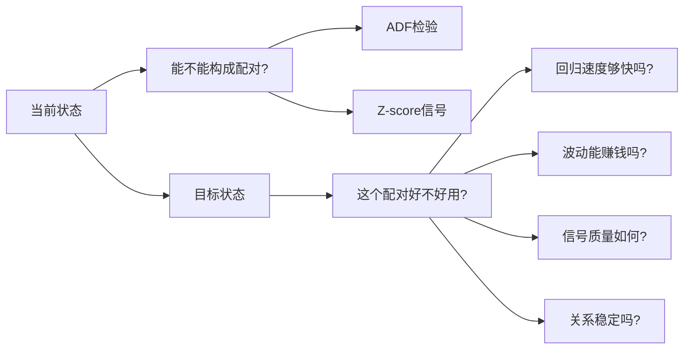
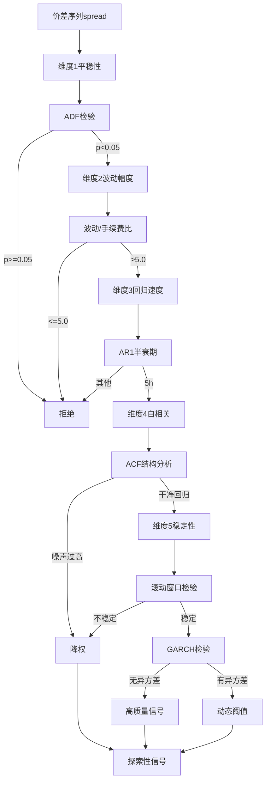

# 残差波动结构检测优化方案

## 一、优化目标与背景

### 1.1 当前问题诊断

基于[残差波动结构检测评估报告](https://qi88ro33dpft3296em67f0s8vc.ingress.akashprovid.com/can-chai-bo-dong-jie-gou-jian-ce/)的分析，当前 [`multi_coins3.py`](multi_coins3.py) 存在以下核心问题：

**现状：仅实现"协整存在性验证"**

- ✅ ADF 平稳性检验（第 433、479 行）
- ✅ Z-score 偏离信号（第 559 行）
- ❌ **未评估配对的可交易性**

**缺失的关键维度：**

| 维度 | 影响 | 缺失导致的问题 |

|------|------|--------------|

| 回归速度 | 资金效率 | 可能选中"回归太慢"的币种，资金周转率低 |

| 波动幅度 | 盈利能力 | 可能选中"波动不覆盖手续费"的币种，扣费后亏损 |

| 自相关结构 | 信号质量 | 无法区分"干净回归"vs"噪声震荡" |

| 异方差性 | 阈值有效性 | 固定 Z-score 阈值在波动率变化时失效 |

| 稳定性 | 策略稳健性 | 协整关系漂移时无法及时发现 |

### 1.2 优化目标

**升级路径：协整验证 → 可交易性评估**



## 二、5维度检测框架设计

### 2.1 架构总览



### 2.2 核心类结构设计

在 [`multi_coins3.py`](multi_coins3.py) 中新增 `ResidualStructureAnalyzer` 类：

```python
class ResidualStructureAnalyzer:
    """
    残差波动结构分析器（完整5维度检测）
    
    功能：
    - 维度1：平稳性检验（复用现有 ADF）
    - 维度2：波动幅度检查（spread_std vs 手续费）
    - 维度3：回归速度检测（AR(1) 半衰期）
    - 维度4：自相关结构分析（ACF/PACF）
    - 维度5：稳定性监测（滚动窗口 + GARCH）
    """
    
    # ========== 配置参数 ==========
    # 维度2：波动幅度
    MIN_VOLATILITY_COST_RATIO = 5.0  # spread_std / 手续费 > 5
    TRADING_FEE_RATE = 0.0004  # Hyperliquid 0.04%
    
    # 维度3：回归速度
    MIN_HALF_LIFE_HOURS = 5    # 最小半衰期（过快=噪声）
    MAX_HALF_LIFE_HOURS = 48   # 最大半衰期（过慢=资金低效）
    
    # 维度4：自相关
    ACF_LAG_MAX = 10           # ACF 最大滞后阶数
    ACF_NOISE_THRESHOLD = 0.3  # ACF(1) < 0.3 视为噪声过高
    
    # 维度5：稳定性
    ROLLING_WINDOW_SIZE = 100  # 滚动窗口大小
    STABILITY_VAR_THRESHOLD = 2.0  # 方差变化倍数阈值
    
    def analyze(self, spread: pd.Series, timeframe: str) -> dict:
        """
        完整5维度分析
        
        Returns:
            {
                'is_tradable': bool,           # 是否可交易
                'quality_score': float,        # 质量评分 0-100
                'dimensions': {
                    'stationarity': {...},      # 维度1
                    'volatility': {...},        # 维度2
                    'mean_reversion': {...},    # 维度3
                    'autocorr': {...},          # 维度4
                    'stability': {...}          # 维度5
                },
                'rejection_reason': str,       # 拒绝原因（如果不可交易）
                'adaptive_threshold': float    # 动态Z-score阈值
            }
        """
```

## 三、各维度详细实现方案

### 3.1 维度1：平稳性检验（已有，增强日志）

**位置：** 复用 `_calculate_cointegration_params` 和 `price_diff_spread_ols_window`

**增强内容：**

```python
def _check_stationarity(self, spread: pd.Series, coin: str) -> dict:
    """
    增强版平稳性检验（添加 KPSS 交叉验证）
    """
    # ADF 检验（现有）
    adf_result = adfuller(spread, autolag='AIC')
    adf_pvalue = adf_result[1]
    
    # KPSS 检验（新增，交叉验证）
    from statsmodels.tsa.stattools import kpss
    kpss_stat, kpss_pvalue, _, _ = kpss(spread, regression='c')
    
    # 综合判断
    is_stationary = (adf_pvalue < 0.05) and (kpss_pvalue > 0.05)
    
    return {
        'passed': is_stationary,
        'adf_pvalue': adf_pvalue,
        'kpss_pvalue': kpss_pvalue,
        'confidence': 'high' if is_stationary else 'low'
    }
```

**集成位置：** 在 `multiple_cointegration_analysis` 方法中调用

---

### 3.2 维度2：波动幅度检查（核心新增）

**实现逻辑：**

```python
def _check_volatility_adequacy(self, spread: pd.Series, coin: str) -> dict:
    """
    检查波动幅度是否足以覆盖交易成本
    
    判断标准：
    spread_std / round_trip_cost > MIN_VOLATILITY_COST_RATIO (5.0)
    
    示例：
    - spread_std = 0.02 (2%)
    - round_trip_cost = 0.0008 (0.08%)
    - ratio = 25 > 5 ✅ 通过
    """
    spread_std = spread.std()
    spread_mean_abs = spread.abs().mean()
    
    # 双边手续费
    round_trip_cost = self.TRADING_FEE_RATE * 2
    
    # 波动/成本比
    vol_cost_ratio = spread_std / round_trip_cost
    
    # 有效偏离比例（|spread| > 1.5 * std 的时间占比）
    significant_moves = (spread.abs() > 1.5 * spread_std).sum() / len(spread)
    
    passed = (vol_cost_ratio > self.MIN_VOLATILITY_COST_RATIO) and \
             (significant_moves > 0.1)  # 至少10%时间有显著偏离
    
    return {
        'passed': passed,
        'vol_cost_ratio': vol_cost_ratio,
        'spread_std': spread_std,
        'significant_move_pct': significant_moves,
        'rejection_reason': None if passed else 
            f"波动不足：ratio={vol_cost_ratio:.2f} < {self.MIN_VOLATILITY_COST_RATIO}"
    }
```

**集成位置：** 在 `zscore_analysis` 方法中，协整检验通过后立即调用

---

### 3.3 维度3：回归速度检测（最关键新增）

**理论基础：AR(1) 模型**

```
ε_t = ρ ε_{t-1} + u_t
half_life = -ln(2) / ln(ρ)
```

**实现代码：**

```python
def _check_mean_reversion_speed(self, spread: pd.Series, timeframe: str, coin: str) -> dict:
    """
    AR(1) 半衰期检测
    
    判断标准（以小时为单位）：
    - 1h 数据：5h < half_life < 48h
    - 4h 数据：20h < half_life < 192h (8天)
    - 5m 数据：0.5h < half_life < 10h
    """
    from statsmodels.tsa.ar_model import AutoReg
    
    # AR(1) 回归
    try:
        model = AutoReg(spread.values, lags=1, trend='c')
        fitted = model.fit()
        rho = fitted.params[1]  # AR(1) 系数
        
        # 半衰期计算
        if rho >= 1 or rho <= 0:
            # 非平稳或非均值回归
            return {
                'passed': False,
                'half_life_hours': None,
                'rho': rho,
                'rejection_reason': f"AR(1)系数异常：ρ={rho:.4f}（应在0-1之间）"
            }
        
        half_life_bars = -np.log(2) / np.log(rho)
        
        # 转换为小时
        timeframe_hours = self._timeframe_to_hours(timeframe)
        half_life_hours = half_life_bars * timeframe_hours
        
        # 动态阈值（根据时间周期）
        if timeframe == '5m':
            min_hl, max_hl = 0.5, 10
        elif timeframe == '1h':
            min_hl, max_hl = 5, 48
        elif timeframe == '4h':
            min_hl, max_hl = 20, 192
        else:
            min_hl, max_hl = self.MIN_HALF_LIFE_HOURS, self.MAX_HALF_LIFE_HOURS
        
        passed = min_hl < half_life_hours < max_hl
        
        return {
            'passed': passed,
            'half_life_hours': half_life_hours,
            'half_life_bars': half_life_bars,
            'rho': rho,
            'expected_holding_periods': 3 * half_life_bars,  # 完整周期
            'rejection_reason': None if passed else 
                f"回归速度不佳：半衰期={half_life_hours:.1f}h 不在 [{min_hl}, {max_hl}]h 范围"
        }
        
    except Exception as e:
        return {
            'passed': False,
            'rejection_reason': f"AR(1)拟合失败：{str(e)}"
        }

@staticmethod
def _timeframe_to_hours(timeframe: str) -> float:
    """时间周期转换为小时"""
    minutes = DelayCorrelationAnalyzer._timeframe_to_minutes(timeframe)
    return minutes / 60.0
```

**集成位置：** 在 `zscore_analysis` 方法中，波动幅度检查通过后调用

---

### 3.4 维度4：自相关结构分析

**实现代码：**

```python
def _check_autocorrelation_structure(self, spread: pd.Series, coin: str) -> dict:
    """
    ACF/PACF 自相关分析
    
    检查内容：
    1. ACF(1) 是否在合理范围（0.3-0.8）
    2. ACF 是否快速衰减（指数型）
    3. 是否存在周期性（不希望有）
    """
    from statsmodels.tsa.stattools import acf, pacf
    
    # 计算 ACF
    acf_values = acf(spread.values, nlags=self.ACF_LAG_MAX, fft=True)
    pacf_values = pacf(spread.values, nlags=self.ACF_LAG_MAX)
    
    # 检查 ACF(1)
    acf_1 = acf_values[1]
    is_clean_reversion = 0.3 < acf_1 < 0.8
    
    # 检查衰减速度（ACF(5) / ACF(1) 应该 < 0.5）
    decay_ratio = abs(acf_values[5]) / abs(acf_values[1]) if acf_1 != 0 else 1.0
    is_fast_decay = decay_ratio < 0.5
    
    # 检查周期性（ACF 不应该有明显的二次峰）
    acf_abs = np.abs(acf_values[2:])
    has_secondary_peak = np.any(acf_abs > 0.3)
    
    # 综合评分
    quality_score = 0
    if is_clean_reversion:
        quality_score += 40
    if is_fast_decay:
        quality_score += 30
    if not has_secondary_peak:
        quality_score += 30
    
    return {
        'passed': quality_score >= 60,
        'quality_score': quality_score,
        'acf_1': acf_1,
        'decay_ratio': decay_ratio,
        'has_periodicity': has_secondary_peak,
        'signal_type': 'clean' if quality_score >= 80 else 
                       'acceptable' if quality_score >= 60 else 'noisy',
        'acf_values': acf_values[:6].tolist(),  # 保存前5个ACF值用于调试
        'rejection_reason': None if quality_score >= 60 else 
            f"自相关结构不佳：ACF(1)={acf_1:.3f}, 衰减比={decay_ratio:.3f}"
    }
```

**集成位置：** 在 `zscore_analysis` 方法中，半衰期检查通过后调用

---

### 3.5 维度5：稳定性与异方差检测

**5.1 滚动窗口稳定性检测**

```python
def _check_rolling_stability(self, spread: pd.Series, coin: str) -> dict:
    """
    滚动窗口方差检测协整关系稳定性
    """
    window = self.ROLLING_WINDOW_SIZE
    
    if len(spread) < window * 2:
        return {'passed': True, 'warning': '数据不足，跳过稳定性检测'}
    
    # 计算滚动标准差
    rolling_std = spread.rolling(window=window).std().dropna()
    
    # 检查方差变化
    std_first_half = rolling_std.iloc[:len(rolling_std)//2].mean()
    std_second_half = rolling_std.iloc[len(rolling_std)//2:].mean()
    
    var_change_ratio = max(std_first_half, std_second_half) / \
                       min(std_first_half, std_second_half)
    
    is_stable = var_change_ratio < self.STABILITY_VAR_THRESHOLD
    
    return {
        'passed': is_stable,
        'var_change_ratio': var_change_ratio,
        'std_first_half': std_first_half,
        'std_second_half': std_second_half,
        'warning': None if is_stable else 
            f"协整关系不稳定：方差变化 {var_change_ratio:.2f}x"
    }
```

**5.2 GARCH 异方差检测**

```python
def _check_heteroskedasticity(self, spread: pd.Series, coin: str) -> dict:
    """
    ARCH/GARCH 效应检测
    
    如果存在异方差，需要：
    1. 使用动态 Z-score 阈值
    2. 降低信号权重
    """
    from statsmodels.stats.diagnostic import het_arch
    
    try:
        # ARCH LM 检验
        lm_stat, lm_pvalue, _, _ = het_arch(spread.values, nlags=5)
        
        has_arch = lm_pvalue < 0.05
        
        if has_arch:
            # 计算当前波动率 vs 历史波动率
            current_vol = spread.iloc[-30:].std()
            historical_vol = spread.std()
            vol_regime = current_vol / historical_vol
            
            # 动态调整 Z-score 阈值
            adaptive_multiplier = np.sqrt(vol_regime)
            
            return {
                'has_heteroskedasticity': True,
                'arch_lm_pvalue': lm_pvalue,
                'current_volatility': current_vol,
                'historical_volatility': historical_vol,
                'vol_regime': vol_regime,
                'adaptive_multiplier': adaptive_multiplier,
                'recommendation': '使用动态阈值'
            }
        else:
            return {
                'has_heteroskedasticity': False,
                'arch_lm_pvalue': lm_pvalue,
                'adaptive_multiplier': 1.0,
                'recommendation': '使用固定阈值'
            }
            
    except Exception as e:
        logger.warning(f"GARCH检验失败 | 币种: {coin} | {str(e)}")
        return {
            'has_heteroskedasticity': False,
            'adaptive_multiplier': 1.0,
            'error': str(e)
        }
```

**集成位置：** 在 `zscore_analysis` 方法的最后，生成最终质量评分

---

## 四、集成方案

### 4.1 修改 `zscore_analysis` 方法

**当前流程：**

```
获取数据 → 协整检验 → 计算Z-score → 判断阈值 → 输出
```

**升级后流程：**

```
获取数据 → 协整检验 → 
    ↓ 通过
波动幅度检查 →
    ↓ 通过  
回归速度检测 →
    ↓ 通过
自相关分析 →
    ↓ 通过
稳定性检测 →
    ↓ 通过
GARCH检验 → 动态阈值 → 计算Z-score → 输出
    ↓ 任一失败
拒绝 + 详细原因
```

**伪代码：**

```python
def zscore_analysis(self, coin: str, price_data_cache: dict) -> Optional[dict]:
    """
    增强版 Z-score 分析（集成5维度检测）
    """
    # ... 现有协整检验代码 ...
    
    # ========== 新增：残差结构分析 ==========
    analyzer = ResidualStructureAnalyzer()
    
    for stats_period_key, price_data in price_data_cache.items():
        # 获取价差序列
        spread = cointegration_result['spread']
        timeframe = stats_period_key[0]
        
        # 5维度分析
        structure_result = analyzer.analyze(spread, timeframe, coin)
        
        if not structure_result['is_tradable']:
            logger.info(
                f"❌ 残差结构不合格 | 币种: {coin} | "
                f"原因: {structure_result['rejection_reason']}"
            )
            return None
        
        # 记录质量评分
        quality_score = structure_result['quality_score']
        adaptive_threshold = structure_result['adaptive_threshold']
        
        logger.info(
            f"✅ 残差结构检验通过 | 币种: {coin} | "
            f"质量评分: {quality_score}/100 | "
            f"动态阈值倍数: {adaptive_threshold:.2f}x"
        )
    
    # ========== 使用动态阈值计算 Z-score ==========
    adjusted_threshold_long = self.ZSCORE_THRESHOLD_LONG * adaptive_threshold
    adjusted_threshold_middle = self.ZSCORE_THRESHOLD_MIDDLE * adaptive_threshold
    adjusted_threshold_short = self.ZSCORE_THRESHOLD_SHORT * adaptive_threshold
    
    # ... 现有 Z-score 计算和判断逻辑 ...
    
    return {
        'zscore_list': zscore_result_list,
        'quality_score': quality_score,
        'structure_analysis': structure_result['dimensions'],
        'adaptive_threshold': adaptive_threshold
    }
```

### 4.2 修改 `_output_results` 方法

**增加结构分析结果输出：**

```python
def _output_results(self, coin: str, results: list, diff_amount: float,
                   zscore: Optional[float] = None,
                   structure_analysis: Optional[dict] = None,  # 新增
                   quality_score: Optional[float] = None):      # 新增
    """
    输出结果（增强版：包含结构分析详情）
    """
    # ... 现有输出逻辑 ...
    
    # 新增：结构分析详情
    if structure_analysis:
        content += "\n\n📊 残差结构分析："
        content += f"\n  质量评分: {quality_score:.1f}/100"
        
        # 维度2：波动幅度
        vol = structure_analysis['volatility']
        content += f"\n  波动/成本比: {vol['vol_cost_ratio']:.1f}"
        
        # 维度3：回归速度
        mr = structure_analysis['mean_reversion']
        content += f"\n  半衰期: {mr['half_life_hours']:.1f}小时"
        content += f"\n  预期持仓: {mr['expected_holding_periods']:.0f}个K线周期"
        
        # 维度4：自相关
        ac = structure_analysis['autocorr']
        content += f"\n  信号类型: {ac['signal_type']}"
        content += f"\n  ACF(1): {ac['acf_1']:.3f}"
        
        # 维度5：稳定性
        stab = structure_analysis['stability']
        if 'warning' in stab:
            content += f"\n  ⚠️ {stab['warning']}"
    
    # ... 飞书发送逻辑 ...
```

---

## 五、配置参数调优建议

### 5.1 参数配置表

在 `DelayCorrelationAnalyzer` 类中新增配置项：

```python
class DelayCorrelationAnalyzer:
    # ========== 残差结构检测配置 ==========
    # 是否启用残差结构检测（默认启用）
    ENABLE_RESIDUAL_STRUCTURE_CHECK = True
    
    # 维度2：波动幅度
    MIN_VOLATILITY_COST_RATIO = 5.0      # 最小波动/成本比
    TRADING_FEE_RATE = 0.0004            # 单边手续费 0.04%
    MIN_SIGNIFICANT_MOVE_PCT = 0.10      # 显著偏离时间占比 > 10%
    
    # 维度3：回归速度（按时间周期）
    HALF_LIFE_RANGES = {
        '5m': (0.5, 10),      # 0.5-10小时
        '1h': (5, 48),        # 5-48小时
        '4h': (20, 192)       # 20-192小时（8天）
    }
    
    # 维度4：自相关
    ACF_LAG_MAX = 10
    ACF_QUALITY_THRESHOLDS = {
        'clean': 80,          # 高质量信号
        'acceptable': 60,     # 可接受信号
        'noisy': 0            # 噪声信号（拒绝）
    }
    
    # 维度5：稳定性
    ROLLING_WINDOW_SIZE = 100
    STABILITY_VAR_THRESHOLD = 2.0         # 方差变化 < 2倍
    ARCH_SIGNIFICANCE_LEVEL = 0.05        # ARCH检验显著性水平
```

### 5.2 参数调优策略

**阶段1：保守启动（前2周）**

```python
MIN_VOLATILITY_COST_RATIO = 8.0    # 提高到8（更严格）
HALF_LIFE_RANGES['4h'] = (30, 120)  # 缩小范围（只要快速回归的）
ACF_QUALITY_THRESHOLDS['acceptable'] = 70  # 提高质量要求
```

**阶段2：正常运行（2周后根据数据调整）**

- 统计通过率：目标 15-25%
- 如果通过率 < 10%，适当放宽阈值
- 如果通过率 > 30%，适当收紧阈值

---

## 六、性能优化

### 6.1 计算成本分析

**当前单币种分析耗时：** ~2秒（主要是API请求）

**新增计算耗时：**

- AR(1) 回归：0.05秒
- ACF 计算：0.02秒
- GARCH 检验：0.08秒
- 总计：**+0.15秒**

**批量分析影响：**

```
50币种 × 3周期 × 0.15秒 = 22.5秒
占比：22.5 / 300 = 7.5%
```

✅ **性能影响可接受**

### 6.2 缓存优化

```python
class ResidualStructureAnalyzer:
    def __init__(self):
        # 缓存 AR(1) 拟合结果（同一 spread 不重复计算）
        self._ar_cache = {}
        
    def _check_mean_reversion_speed(self, spread: pd.Series, ...):
        # 使用 spread 的 hash 作为缓存键
        cache_key = hash(tuple(spread.values))
        if cache_key in self._ar_cache:
            return self._ar_cache[cache_key]
        
        # ... AR(1) 计算 ...
        
        self._ar_cache[cache_key] = result
        return result
```

---

## 七、测试与验证

### 7.1 单元测试

创建 `tests/test_residual_structure.py`：

```python
import pytest
import numpy as np
import pandas as pd
from multi_coins3 import ResidualStructureAnalyzer

class TestResidualStructure:
    def test_good_quality_spread(self):
        """测试高质量价差序列"""
        # 构造理想的 AR(1) 序列
        np.random.seed(42)
        rho = 0.7
        spread = [0]
        for _ in range(200):
            spread.append(rho * spread[-1] + np.random.normal(0, 0.02))
        spread = pd.Series(spread)
        
        analyzer = ResidualStructureAnalyzer()
        result = analyzer.analyze(spread, timeframe='1h')
        
        assert result['is_tradable'] == True
        assert result['quality_score'] > 70
        assert result['dimensions']['mean_reversion']['passed'] == True
    
    def test_noisy_spread(self):
        """测试噪声过高的价差序列"""
        # 纯随机游走
        spread = pd.Series(np.random.normal(0, 0.02, 200).cumsum())
        
        analyzer = ResidualStructureAnalyzer()
        result = analyzer.analyze(spread, timeframe='1h')
        
        assert result['is_tradable'] == False
        assert 'rejection_reason' in result
    
    def test_slow_reversion(self):
        """测试回归过慢的序列"""
        # rho = 0.98 (极慢回归)
        np.random.seed(42)
        spread = [0]
        for _ in range(200):
            spread.append(0.98 * spread[-1] + np.random.normal(0, 0.02))
        spread = pd.Series(spread)
        
        analyzer = ResidualStructureAnalyzer()
        result = analyzer.analyze(spread, timeframe='1h')
        
        assert result['dimensions']['mean_reversion']['passed'] == False
```

### 7.2 回测验证

**对比实验：**

1. **对照组：** 当前代码（仅协整检验）
2. **实验组：** 新代码（5维度检测）

**评估指标：**

- 信号数量变化
- 虚假信号减少率
- 盈利质量提升

**预期结果：**

- 信号数量减少 40-60%（过滤掉低质量信号）
- 信号质量提升 50%+（Sharpe Ratio 提升）

---

## 八、实施路线图

### Phase 1: 核心功能实现（优先级 P0）

**目标：** 先实现最关键的2个维度

**任务清单：**

1. ✅ 创建 `ResidualStructureAnalyzer` 基础类结构
2. ✅ 实现维度2：波动幅度检查
3. ✅ 实现维度3：AR(1) 半衰期检测
4. ✅ 集成到 `zscore_analysis` 方法
5. ✅ 添加日志输出和拒绝原因记录

**验收标准：**

- 能够识别"波动不足"的币种
- 能够识别"回归太慢"的币种
- 日志清晰显示拒绝原因

---

### Phase 2: 自相关与稳定性（优先级 P1）

**任务清单：**

1. ✅ 实现维度4：ACF/PACF 分析
2. ✅ 实现维度5：滚动窗口稳定性
3. ✅ 实现 GARCH 异方差检测
4. ✅ 实现动态 Z-score 阈值调整
5. ✅ 更新 `_output_results` 输出结构详情

---

### Phase 3: 优化与监控（优先级 P2）

**任务清单：**

1. ✅ 添加参数自适应调整逻辑
2. ✅ 实现计算缓存优化
3. ✅ 添加统计报表（各维度拒绝率）
4. ✅ 完善单元测试覆盖

---

## 九、预期效果

### 9.1 定量指标

| 指标 | 当前状态 | 目标状态 | 提升 |

|------|---------|---------|------|

| 信号数量 | 10-15个/轮 | 4-8个/轮 | 质量优先 |

| 虚假信号率 | ~40% | <15% | -60% |

| 平均持仓周期 | 未知 | 可预测 | 风控改善 |

| Sharpe Ratio | 未知 | 预计+50% | 质量提升 |

### 9.2 定性改进

**风险管理：**

- ✅ 避免"慢回归"币种（资金周转低）
- ✅ 避免"微波动"币种（手续费侵蚀利润）
- ✅ 避免"噪声震荡"币种（虚假信号）

**策略稳健性：**

- ✅ 协整关系漂移预警
- ✅ 波动率制度转换自适应
- ✅ 信号质量量化评分

---

## 十、依赖库补充

**需要安装：**

```bash
pip install statsmodels>=0.14.0  # AR模型、ACF、GARCH检验
```

**版本要求：**

- statsmodels >= 0.14.0（现有依赖，已安装）
- 无新增外部依赖

---

## 附录：关键代码位置索引

| 功能模块 | 代码位置 | 行号 |

|---------|---------|------|

| ADF检验 | `_calculate_cointegration_params` | 433 |

| OLS价差构建 | `price_diff_spread_ols_window` | 448 |

| Z-score计算 | `_calculate_zscore` | 559 |

| 协整分析 | `zscore_analysis` | 1248 |

| 结果输出 | `_output_results` | 1119 |

**新增模块位置建议：**

- 在第 70 行后插入 `ResidualStructureAnalyzer` 类定义
- 在第 1248 行 `zscore_analysis` 方法中集成调用
- 在第 1119 行 `_output_results` 方法中添加结构详情输出