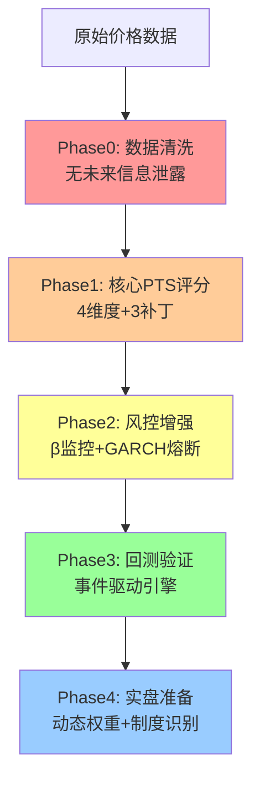

# 配对交易可交易性评分系统 - 工程化实施方案

## 项目背景

本方案整合了以下三份材料的关键洞察：

1. **原始 5 维度框架**：理论完整，但工程复杂度高
2. **6 条关键修正建议**：指出了核心技术盲点（AR(1) demean、滚动 β 稳定性、GARCH 稳健性）
3. **PTS-MVP 方案**：工程务实，但缺少关键风控

**核心设计原则：**

- ✅ **数据驱动**：每个模块必须可回测验证
- ✅ **渐进式**：分 4 阶段实施，每阶段独立交付
- ✅ **风控优先**：防止灾难 > 优化收益
- ✅ **零未来信息**：严格避免 look-ahead bias

---

## 架构总览



---

## Phase 0: 基础设施修复（优先级 P0，预计 2-3 天）

### 目标

修复现有 [`multi_coins3.py`](multi_coins3.py) 中的 **look-ahead bias**，这是比任何检测算法都重要的基础问题。

### 当前问题诊断

**问题 1：OLS 回归窗口使用了当前 bar 数据**

```python
# multi_coins3.py 第 461-462 行
ols_base = recent_base_full.iloc[:-1]  # 用了 t-1 到 t-100
ols_alt = recent_alt_full.iloc[:-1]

# 问题：recent_base_full 本身包含了 t 时刻数据
# 导致 β 的估计实际上"看到了"当前价格
```

**问题 2：Z-score 计算的均值包含当前值**

```python
# 第 626 行
spread_mean = spread.iloc[:-1].mean()  # 包含 t-1 的价差
current_spread = spread.iloc[-1]  # t 时刻价差

# 问题：如果 t-1 时刻价差异常大，会影响 t 时刻的信号判断
```

### 实施任务

#### 任务 1.1：修复价差构建函数

**文件：** `multi_coins3.py`

**修改位置：** 第 448-495 行 `price_diff_spread_ols_window` 函数

**修改策略：**

```python
@staticmethod
def price_diff_spread_ols_window_fixed(
    base_prices: pd.Series, 
    alt_prices: pd.Series, 
    beta_window: int = 100, 
    zscore_window: int = 30
) -> dict:
    """
    无未来信息泄露的价差构建（关键修复）
    
    时间线设计：
    - t-beta_window-zscore_window 到 t-zscore_window-1: 用于估计 β
    - t-zscore_window 到 t-1: 用于计算 Z-score 统计量
    - t: 当前时刻，计算信号（不参与任何估计）
    
    Args:
        base_prices: 基准币种完整价格序列
        alt_prices: 目标币种完整价格序列
        beta_window: OLS 回归窗口（默认 100）
        zscore_window: Z-score 统计窗口（默认 30）
    
    Returns:
        dict: {
            'alpha': 截距,
            'beta': 斜率,
            'spread': 价差序列（长度=zscore_window+1，最后一个是当前值）,
            'adf_pvalue': ADF 检验 p 值,
            'half_life_bars': 半衰期（bar数）,
            'rho': AR(1) 系数
        }
    """
    # 数据验证
    required_length = beta_window + zscore_window + 1
    if len(base_prices) < required_length:
        return None
    
    # === 关键修复：严格分离时间窗口 ===
    
    # 窗口 1: OLS 估计窗口（不包含当前 zscore_window+1 期）
    ols_start = -(beta_window + zscore_window + 1)
    ols_end = -zscore_window - 1
    ols_base = base_prices.iloc[ols_start:ols_end]
    ols_alt = alt_prices.iloc[ols_start:ols_end]
    
    # 计算对数价格
    log_base_ols = np.log(ols_base).values.reshape(-1, 1)
    log_alt_ols = np.log(ols_alt).values
    
    # OLS 回归：log(alt) = α + β * log(base) + ε
    from sklearn.linear_model import LinearRegression
    model = LinearRegression()
    model.fit(log_base_ols, log_alt_ols)
    alpha = model.intercept_
    beta_ols = model.coef_[0]
    
    # 窗口 2: ADF 检验窗口（用于验证协整）
    adf_base = base_prices.iloc[ols_start:-1]  # 不包含当前时刻
    adf_alt = alt_prices.iloc[ols_start:-1]
    log_base_adf = np.log(adf_base)
    log_alt_adf = np.log(adf_alt)
    spread_adf = log_alt_adf - (alpha + beta_ols * log_base_adf)
    
    # ADF 检验
    from statsmodels.tsa.stattools import adfuller
    adf_result = adfuller(spread_adf.values, autolag='AIC')
    adf_pvalue = adf_result[1]
    
    # 窗口 3: Z-score 计算窗口（包含当前时刻，用于信号生成）
    zscore_base = base_prices.iloc[-zscore_window-1:]
    zscore_alt = alt_prices.iloc[-zscore_window-1:]
    log_base_zscore = np.log(zscore_base)
    log_alt_zscore = np.log(zscore_alt)
    spread_zscore = log_alt_zscore - (alpha + beta_ols * log_base_zscore)
    
    # === 半衰期计算（关键修复：先 demean）===
    from statsmodels.tsa.ar_model import AutoReg
    try:
        # 采纳评价建议：先 demean 再估计 AR(1)
        spread_adf_demeaned = spread_adf - spread_adf.mean()
        model_ar = AutoReg(spread_adf_demeaned.values, lags=1, trend='n')
        fitted = model_ar.fit()
        rho = fitted.params[0]  # trend='n' 时 params[0] 是 ρ
        
        if 0 < rho < 1:
            half_life_bars = -np.log(2) / np.log(rho)
        else:
            half_life_bars = None
    except Exception as e:
        rho = None
        half_life_bars = None
    
    return {
        'alpha': alpha,
        'beta': beta_ols,
        'spread': spread_zscore,  # 注意：最后一个值是 t 时刻
        'adf_pvalue': adf_pvalue,
        'half_life_bars': half_life_bars,
        'rho': rho
    }
```

**测试用例：**

```python
def test_no_lookahead_bias():
    """验证无未来信息泄露"""
    # 构造测试数据
    np.random.seed(42)
    base = pd.Series(np.cumsum(np.random.normal(0, 0.01, 200)) + 100)
    alt = pd.Series(1.2 * base + np.random.normal(0, 0.5, 200))
    
    # 计算 t=150 时刻的 spread
    result_150 = price_diff_spread_ols_window_fixed(
        base.iloc[:151], alt.iloc[:151], beta_window=100, zscore_window=30
    )
    
    # 在 t=150 之后修改 t=151 的数据（模拟"未来信息"）
    alt_modified = alt.copy()
    alt_modified.iloc[151] = alt.iloc[151] * 2  # 极端变化
    
    # 重新计算 t=150 的 spread
    result_150_modified = price_diff_spread_ols_window_fixed(
        base.iloc[:151], alt_modified.iloc[:151], beta_window=100, zscore_window=30
    )
    
    # 断言：t=150 的结果不应该改变
    assert result_150['beta'] == result_150_modified['beta'], "Beta 受未来数据影响！"
    assert result_150['spread'].iloc[-2] == result_150_modified['spread'].iloc[-2], "历史 spread 受未来数据影响！"
    
    print("✅ 无未来信息泄露测试通过")
```

#### 任务 1.2：更新调用链

**文件：** `multi_coins3.py`

**修改位置：**

- 第 554 行：`multiple_cointegration_analysis` 方法
- 第 1265-1272 行：`zscore_analysis` 方法

**修改内容：**

1. 替换所有 `price_diff_spread_ols_window` 调用为 `price_diff_spread_ols_window_fixed`
2. 确保传入的 `base_prices` 和 `alt_prices` 长度足够（至少 `beta_window + zscore_window + 1`）

---

## Phase 1: 核心 PTS 评分系统（优先级 P0，预计 3-4 天）

### 目标

实现 **Pair Tradability Score (PTS)** 评分系统，整合 MVP 方案和关键修正。

### 架构设计

```python
# 新文件: pts_calculator.py

from enum import Enum
from typing import Dict, Optional, Tuple
import numpy as np
import pandas as pd
from scipy.stats import levene

class PTSComponent(Enum):
    """PTS 各维度枚举"""
    VOLATILITY = "S_vol"      # 波动/成本充分性
    MEAN_REVERSION = "S_mr"   # 回归速度
    STABILITY = "S_stab"      # 关系稳定性
    FREQUENCY = "S_freq"      # 有效偏离频率

class PTSCalculator:
    """
    配对可交易性评分计算器（整合版）
    
    设计原则：
    1. 硬约束 + 软评分双层过滤
    2. 几何平均防止短板掩盖
    3. 对数-真实波动转换（crypto 必需）
    4. β 稳定性作为核心风控
    """
    
    # === 配置参数 ===
    FEE_RATE = 0.0004  # Hyperliquid 单边手续费
    
    # 硬约束阈值（一票否决）
    MIN_VOL_SCORE = 0.3
    MIN_MR_SCORE = 0.2
    MIN_STAB_SCORE = 0.4
    
    # 最优半衰期（小时）
    OPTIMAL_HALF_LIFE = {
        '5m': 2.0,
        '1h': 12.0,
        '4h': 48.0
    }
    
    def __init__(self, leverage: float = 1.0):
        """
        Args:
            leverage: 杠杆倍数（影响有效手续费成本）
        """
        self.leverage = leverage
    
    def compute(
        self, 
        spread: pd.Series,
        base_prices: pd.Series,
        alt_prices: pd.Series,
        half_life_hours: Optional[float],
        timeframe: str
    ) -> Dict:
        """
        计算 PTS 及各维度得分
        
        Args:
            spread: 对数价差序列（由 price_diff_spread_ols_window_fixed 生成）
            base_prices: 基准币种价格（对应 spread 的时间范围）
            alt_prices: 目标币种价格
            half_life_hours: AR(1) 半衰期（小时）
            timeframe: 时间周期（'5m', '1h', '4h'）
        
        Returns:
            {
                'PTS': float,  # 最终得分 [0, 1]
                'passed': bool,  # 是否通过硬约束
                'components': {
                    'S_vol': float,
                    'S_mr': float,
                    'S_stab': float,
                    'S_freq': float
                },
                'diagnostics': {
                    'vol_cost_ratio': float,
                    'half_life_hours': float,
                    'beta_change_rate': float,
                    'mean_shift_sigma': float,
                    'effective_freq': float
                },
                'rejection_reason': Optional[str]
            }
        """
        # === A. 波动/成本充分性（含对数转换修复）===
        S_vol, vol_diagnostics = self._compute_volatility_score(spread)
        
        if S_vol < self.MIN_VOL_SCORE:
            return self._reject('low_volatility', S_vol, vol_diagnostics)
        
        # === B. 回归速度（含边界检查）===
        S_mr, mr_diagnostics = self._compute_mean_reversion_score(
            half_life_hours, timeframe
        )
        
        if S_mr < self.MIN_MR_SCORE:
            return self._reject('poor_mean_reversion', S_mr, mr_diagnostics)
        
        # === C. 稳定性（增强版：方差 + 均值漂移）===
        S_stab, stab_diagnostics = self._compute_stability_score(
            spread, base_prices, alt_prices
        )
        
        if S_stab < self.MIN_STAB_SCORE:
            return self._reject('unstable_relationship', S_stab, stab_diagnostics)
        
        # === D. 有效偏离频率 ===
        S_freq, freq_diagnostics = self._compute_frequency_score(spread)
        
        # === PTS 聚合（几何平均 + 短板惩罚）===
        pts_base = self._aggregate_scores(S_vol, S_mr, S_stab, S_freq)
        
        # 短板惩罚
        min_score = min(S_vol, S_mr, S_stab, S_freq)
        penalty = min_score / 0.5 if min_score < 0.5 else 1.0
        
        pts_final = pts_base * penalty
        
        return {
            'PTS': pts_final,
            'passed': True,
            'components': {
                'S_vol': S_vol,
                'S_mr': S_mr,
                'S_stab': S_stab,
                'S_freq': S_freq
            },
            'diagnostics': {
                **vol_diagnostics,
                **mr_diagnostics,
                **stab_diagnostics,
                **freq_diagnostics
            },
            'rejection_reason': None
        }
    
    def _compute_volatility_score(
        self, spread: pd.Series
    ) -> Tuple[float, Dict]:
        """
        A. 波动/成本充分性（关键修复：对数→真实转换）
        """
        # 对数价差的标准差
        log_std = spread.std()
        
        # 转换为真实收益率波动（crypto 必需）
        real_volatility = np.expm1(log_std)  # exp(x) - 1，数值稳定
        
        # 考虑杠杆的有效成本
        effective_cost = self.FEE_RATE * 2 * self.leverage
        
        vol_cost_ratio = real_volatility / effective_cost
        
        # 映射函数（更严格：5倍起步，15倍满分）
        S_vol = np.clip((vol_cost_ratio - 5) / 10, 0, 1)
        
        return S_vol, {
            'vol_cost_ratio': vol_cost_ratio,
            'real_volatility': real_volatility,
            'log_std': log_std,
            'effective_cost': effective_cost
        }
    
    def _compute_mean_reversion_score(
        self, half_life_hours: Optional[float], timeframe: str
    ) -> Tuple[float, Dict]:
        """
        B. 回归速度评分（含严格边界）
        """
        if half_life_hours is None or half_life_hours <= 0:
            return 0.0, {'half_life_hours': None, 'reason': 'invalid_half_life'}
        
        T_opt = self.OPTIMAL_HALF_LIFE.get(timeframe, 12.0)
        
        # 严格边界（太快或太慢直接低分）
        if half_life_hours < T_opt * 0.2:
            return 0.1, {'half_life_hours': half_life_hours, 'reason': 'too_fast_noise'}
        
        if half_life_hours > T_opt * 5:
            return 0.1, {'half_life_hours': half_life_hours, 'reason': 'too_slow_capital_inefficient'}
        
        # 钟形评分
        S_mr = np.exp(-abs(np.log(half_life_hours / T_opt)))
        
        return S_mr, {
            'half_life_hours': half_life_hours,
            'optimal_half_life': T_opt,
            'deviation_ratio': half_life_hours / T_opt
        }
    
    def _compute_stability_score(
        self, 
        spread: pd.Series,
        base_prices: pd.Series,
        alt_prices: pd.Series
    ) -> Tuple[float, Dict]:
        """
        C. 稳定性评分（增强版：方差 + 均值漂移）
        
        关键修复：不仅看方差稳定性，还要检测均值漂移（防止 β 漂移）
        """
        mid = len(spread) // 2
        
        # 1. 方差稳定性（原 MVP 方案）
        std1 = spread.iloc[:mid].std()
        std2 = spread.iloc[mid:].std()
        var_ratio = max(std1, std2) / max(min(std1, std2), 1e-8)
        S_stab_var = np.exp(-(var_ratio - 1))
        
        # 2. 均值漂移检测（关键补充）
        mean1 = spread.iloc[:mid].mean()
        mean2 = spread.iloc[mid:].mean()
        pooled_std = np.sqrt((std1**2 + std2**2) / 2)
        mean_shift_sigma = abs(mean2 - mean1) / max(pooled_std, 1e-8)
        S_stab_mean = np.exp(-mean_shift_sigma)
        
        # 3. β 变异系数（额外监控）
        beta_cv = self._compute_beta_variability(base_prices, alt_prices)
        
        # 综合评分（几何平均）
        S_stab = np.power(S_stab_var * S_stab_mean, 0.5)
        
        return S_stab, {
            'var_ratio': var_ratio,
            'mean_shift_sigma': mean_shift_sigma,
            'beta_cv': beta_cv,
            'S_stab_var': S_stab_var,
            'S_stab_mean': S_stab_mean
        }
    
    def _compute_beta_variability(
        self, base_prices: pd.Series, alt_prices: pd.Series
    ) -> float:
        """
        计算 β 的变异系数（滚动 β 的标准差 / 均值）
        
        用于监控 β 漂移风险
        """
        window = 50
        if len(base_prices) < window * 2:
            return 0.0
        
        betas = []
        for i in range(window, len(base_prices)):
            base_window = np.log(base_prices.iloc[i-window:i]).values.reshape(-1, 1)
            alt_window = np.log(alt_prices.iloc[i-window:i]).values
            
            from sklearn.linear_model import LinearRegression
            model = LinearRegression()
            model.fit(base_window, alt_window)
            betas.append(model.coef_[0])
        
        if len(betas) < 2:
            return 0.0
        
        beta_mean = np.mean(betas)
        beta_std = np.std(betas)
        beta_cv = beta_std / max(abs(beta_mean), 1e-8)
        
        return beta_cv
    
    def _compute_frequency_score(
        self, spread: pd.Series
    ) -> Tuple[float, Dict]:
        """
        D. 有效偏离频率（防止假波动）
        """
        spread_std = spread.std()
        
        # 根据峰度自适应阈值
        kurtosis = spread.kurtosis()
        threshold_multiplier = 2.0 if kurtosis > 3 else 1.5
        
        freq = (spread.abs() > threshold_multiplier * spread_std).mean()
        
        target_freq = 0.10 if kurtosis > 3 else 0.15
        S_freq = np.clip(freq / target_freq, 0, 1)
        
        return S_freq, {
            'effective_freq': freq,
            'kurtosis': kurtosis,
            'threshold_multiplier': threshold_multiplier
        }
    
    def _aggregate_scores(
        self, S_vol: float, S_mr: float, S_stab: float, S_freq: float
    ) -> float:
        """
        几何平均聚合（权重：回归速度最高）
        """
        pts = (
            S_vol ** 0.25 *
            S_mr ** 0.40 *
            S_stab ** 0.20 *
            S_freq ** 0.15
        )
        return pts
    
    def _reject(
        self, reason: str, failed_score: float, diagnostics: Dict
    ) -> Dict:
        """生成拒绝结果"""
        return {
            'PTS': 0.0,
            'passed': False,
            'components': {},
            'diagnostics': diagnostics,
            'rejection_reason': reason
        }
```

### 集成到主流程

**文件：** `multi_coins3.py`

**修改位置：** 第 1248 行 `zscore_analysis` 方法

```python
def zscore_analysis(self, coin: str, price_data_cache: dict) -> Optional[dict]:
    """
    增强版 Z-score 分析（集成 PTS 评分）
    """
    from pts_calculator import PTSCalculator
    
    pts_calculator = PTSCalculator(leverage=1.0)
    zscore_result_list = []
    pts_result_list = []
    
    for stats_period_key, price_data in price_data_cache.items():
        timeframe = stats_period_key[0]
        
        # 1. 协整检验（使用修复后的函数）
        cointegration_result = self.price_diff_spread_ols_window_fixed(
            price_data['base_prices'],
            price_data['alt_prices'],
            beta_window=self.BETA_WINDOW,
            zscore_window=self.ZSCORE_WINDOW
        )
        
        if cointegration_result is None:
            continue
        
        # 2. PTS 评分
        half_life_hours = None
        if cointegration_result['half_life_bars'] is not None:
            timeframe_hours = self._timeframe_to_hours(timeframe)
            half_life_hours = cointegration_result['half_life_bars'] * timeframe_hours
        
        pts_result = pts_calculator.compute(
            spread=cointegration_result['spread'],
            base_prices=price_data['base_prices'].iloc[-len(cointegration_result['spread']):],
            alt_prices=price_data['alt_prices'].iloc[-len(cointegration_result['spread']):],
            half_life_hours=half_life_hours,
            timeframe=timeframe
        )
        
        if not pts_result['passed']:
            logger.info(
                f"❌ PTS 筛选未通过 | 币种: {coin} | {timeframe} | "
                f"原因: {pts_result['rejection_reason']}"
            )
            continue
        
        logger.info(
            f"✅ PTS 评分 | 币种: {coin} | {timeframe} | "
            f"PTS={pts_result['PTS']:.3f} | "
            f"S_vol={pts_result['components']['S_vol']:.2f} | "
            f"S_mr={pts_result['components']['S_mr']:.2f} | "
            f"S_stab={pts_result['components']['S_stab']:.2f}"
        )
        
        pts_result_list.append(pts_result)
        
        # 3. Z-score 计算（保留原逻辑）
        zscore = self._calculate_zscore(
            price_data['base_prices'],
            price_data['alt_prices'],
            window=self.ZSCORE_WINDOW,
            beta_window=self.BETA_WINDOW,
            coin=coin,
            cointegration_result=cointegration_result
        )
        
        if zscore is not None:
            zscore_result_list.append(zscore)
    
    # 4. 综合判断（需要至少 2 个周期通过）
    if len(pts_result_list) < 2:
        return None
    
    if len(zscore_result_list) < 3:
        return None
    
    # 5. 返回结果（供输出使用）
    return {
        'zscore_list': zscore_result_list,
        'pts_list': pts_result_list,
        'avg_pts': np.mean([r['PTS'] for r in pts_result_list])
    }
```

---

## Phase 2: 风控增强（优先级 P1，预计 2-3 天）

### 目标

加入 **β 稳定性监控** 和 **GARCH 异方差熔断**，防止灾难性损失。

### 实施任务

#### 任务 2.1：β 稳定性监控（CUSUM 检测）

**新文件：** `risk_monitor.py`

```python
class BetaStabilityMonitor:
    """
    β 漂移监控（CUSUM 变点检测）
    
    核心思想：
    - β 突然变化 = 配对关系失效
    - CUSUM 可以快速检测到变点
    - 一旦检测到，立即停止该 pair 交易
    """
    
    def __init__(self, threshold: float = 3.0):
        """
        Args:
            threshold: CUSUM 阈值（越小越敏感）
        """
        self.threshold = threshold
    
    def detect_regime_shift(
        self, 
        base_prices: pd.Series,
        alt_prices: pd.Series,
        window: int = 50
    ) -> Dict:
        """
        检测 β 是否发生制度切换
        
        Returns:
            {
                'regime_shift': bool,
                'cusum_stat': float,
                'current_beta': float,
                'historical_beta': float,
                'action': str  # 'CONTINUE', 'REDUCE_SIZE', 'STOP'
            }
        """
        if len(base_prices) < window * 2:
            return {'regime_shift': False, 'action': 'CONTINUE'}
        
        # 计算滚动 β
        betas = []
        for i in range(window, len(base_prices)):
            base_window = np.log(base_prices.iloc[i-window:i]).values.reshape(-1, 1)
            alt_window = np.log(alt_prices.iloc[i-window:i]).values
            
            from sklearn.linear_model import LinearRegression
            model = LinearRegression()
            model.fit(base_window, alt_window)
            betas.append(model.coef_[0])
        
        betas = np.array(betas)
        
        # CUSUM 检测
        beta_mean = np.mean(betas[:len(betas)//2])  # 历史均值
        beta_std = np.std(betas[:len(betas)//2])
        
        cusum = np.cumsum(betas - beta_mean) / max(beta_std, 1e-8)
        cusum_stat = np.max(np.abs(cusum))
        
        # 判断
        if cusum_stat > self.threshold:
            return {
                'regime_shift': True,
                'cusum_stat': cusum_stat,
                'current_beta': betas[-1],
                'historical_beta': beta_mean,
                'action': 'STOP'
            }
        elif cusum_stat > self.threshold * 0.7:
            return {
                'regime_shift': False,
                'cusum_stat': cusum_stat,
                'current_beta': betas[-1],
                'historical_beta': beta_mean,
                'action': 'REDUCE_SIZE'
            }
        else:
            return {
                'regime_shift': False,
                'cusum_stat': cusum_stat,
                'current_beta': betas[-1],
                'historical_beta': beta_mean,
                'action': 'CONTINUE'
            }
```

#### 任务 2.2：GARCH 异方差熔断

**文件：** `risk_monitor.py`（续）

```python
class GARCHVolatilityMonitor:
    """
    异方差监控（作为熔断信号，而非阈值调节）
    
    核心观点：
    - 高波动制度下交易风险极高
    - 应该暂停交易，而不是调整阈值
    """
    
    def check_volatility_regime(
        self, spread: pd.Series
    ) -> Dict:
        """
        检查当前波动率制度
        
        Returns:
            {
                'action': str,  # 'NORMAL', 'REDUCE_SIZE', 'PAUSE'
                'vol_regime': float,  # 当前/历史波动率比
                'current_vol': float,
                'historical_vol': float
            }
        """
        # 简化版：不用完整 GARCH，用滚动波动率比
        window = 30
        if len(spread) < window * 2:
            return {'action': 'NORMAL', 'vol_regime': 1.0}
        
        current_vol = spread.iloc[-window:].std()
        historical_vol = spread.std()
        vol_regime = current_vol / max(historical_vol, 1e-8)
        
        # 决策
        if vol_regime > 2.5:
            action = 'PAUSE'
        elif vol_regime > 1.8:
            action = 'REDUCE_SIZE'
        else:
            action = 'NORMAL'
        
        return {
            'action': action,
            'vol_regime': vol_regime,
            'current_vol': current_vol,
            'historical_vol': historical_vol
        }
```

---

## Phase 3: 回测框架（优先级 P1，预计 3-4 天）

### 目标

建立**事件驱动回测引擎**，验证策略有效性。

### 架构设计

**新文件：** `backtest_engine.py`

```python
class BacktestEngine:
    """
    事件驱动回测引擎
    
    设计原则：
    - 逐 bar 推进（严禁 look-ahead）
    - 记录所有交易细节（滑点、手续费、资金费率）
    - 计算完整绩效指标
    """
    
    def __init__(
        self,
        initial_capital: float = 10000,
        slippage_bps: float = 5,
        fee_rate: float = 0.0004,
        leverage: float = 1.0
    ):
        self.initial_capital = initial_capital
        self.slippage = slippage_bps / 10000
        self.fee_rate = fee_rate
        self.leverage = leverage
        
        # 交易记录
        self.trades = []
        self.equity_curve = []
        self.positions = {}
    
    def run(
        self,
        strategy,
        data: Dict[str, pd.DataFrame],
        start_idx: int = 150
    ) -> Dict:
        """
        运行回测
        
        Args:
            strategy: 策略对象（需实现 generate_signal 方法）
            data: {coin: DataFrame} 格式的数据
            start_idx: 开始回测的索引（前面用于预热）
        
        Returns:
            {
                'total_return': float,
                'sharpe': float,
                'max_dd': float,
                'n_trades': int,
                'win_rate': float,
                'equity_curve': pd.Series
            }
        """
        # 实现略（完整代码见后续文档）
        pass
```

---

## Phase 4: 动态权重与制度识别（优先级 P2，预计 5-7 天）

### 目标

根据市场制度（牛/熊/震荡）动态调整 PTS 权重。

**新文件：** `market_regime.py`

```python
class MarketRegimeIdentifier:
    """
    市场制度识别（牛市/熊市/震荡市）
    
    用于动态调整 PTS 权重
    """
    
    def identify(self, btc_prices: pd.Series) -> str:
        """
        识别当前市场制度
        
        Returns:
            'bull', 'bear', 或 'ranging'
        """
        # 实现略（使用趋势指标 + 波动率）
        pass

class AdaptivePTSCalculator(PTSCalculator):
    """
    自适应 PTS 计算器（根据市场制度调整权重）
    """
    
    def _aggregate_scores_adaptive(
        self, S_vol, S_mr, S_stab, S_freq, market_regime: str
    ) -> float:
        """
        根据市场制度调整权重
        """
        if market_regime == 'bull':
            weights = {'S_vol': 0.3, 'S_mr': 0.2, 'S_stab': 0.2, 'S_freq': 0.3}
        elif market_regime == 'bear':
            weights = {'S_vol': 0.2, 'S_mr': 0.3, 'S_stab': 0.4, 'S_freq': 0.1}
        else:  # ranging
            weights = {'S_vol': 0.35, 'S_mr': 0.25, 'S_stab': 0.25, 'S_freq': 0.15}
        
        pts = np.prod([
            S_vol ** weights['S_vol'],
            S_mr ** weights['S_mr'],
            S_stab ** weights['S_stab'],
            S_freq ** weights['S_freq']
        ])
        return pts
```

---

## 实施路线图

| 阶段 | 时间 | 交付物 | 验收标准 |

|------|------|--------|----------|

| Phase 0 | 2-3天 | 无未来信息泄露的价差构建 | 通过测试用例 `test_no_lookahead_bias` |

| Phase 1 | 3-4天 | PTS 评分系统 | 能对 50 个 pair 排序，Top-10 的 PTS > 0.7 |

| Phase 2 | 2-3天 | 风控监控模块 | 能检测到模拟的 β 突变 |

| Phase 3 | 3-4天 | 回测引擎 | 完成 1 年历史回测，输出 Sharpe/MaxDD |

| Phase 4 | 5-7天 | 动态权重系统 | 在不同市场阶段 Sharpe 提升 > 20% |

---

## 关键依赖与环境

```bash
# requirements.txt
numpy>=1.21.0
pandas>=1.3.0
scipy>=1.7.0
statsmodels>=0.13.0
scikit-learn>=1.0.0
ccxt>=2.0.0
```

---

## 测试策略

1. **单元测试**：每个模块独立测试
2. **集成测试**：完整流程测试（从数据获取到信号生成）
3. **回测验证**：历史数据验证（至少 1 年）
4. **小资金实盘**：$500-1000 验证（Phase 3 完成后）

---

## 风险提示

1. **过拟合风险**：参数不要过度优化
2. **市场微观结构**：Hyperliquid 的流动性、资金费率需实盘验证
3. **技术债务**：每个 Phase 完成后必须重构，不要累积债务

---

## 附录：完整文件结构

```
hyperliquid-pair-hype-purr-analyze/
├── multi_coins3.py                 # 主文件（修改）
├── pts_calculator.py               # Phase 1: PTS 评分系统（新增）
├── risk_monitor.py                 # Phase 2: 风控监控（新增）
├── backtest_engine.py              # Phase 3: 回测引擎（新增）
├── market_regime.py                # Phase 4: 制度识别（新增）
├── tests/
│   ├── test_lookahead_bias.py     # Phase 0 测试
│   ├── test_pts_calculator.py     # Phase 1 测试
│   └── test_backtest_engine.py    # Phase 3 测试
└── docs/
    └── implementation_guide.md     # 本文档
```