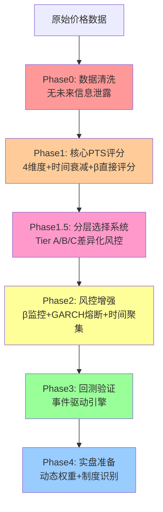

# 配对交易可交易性评分系统 - 工程化实施方案 v2.0

## 📋 版本历史

| 版本 | 日期 | 主要变更 |
|------|------|----------|
| v1.0 | 2026-01-11 | 初始版本：整合三份评价材料 |
| v2.0 | 2026-01-11 | **关键修正**：采纳第四轮评价，增加时间衰减、β直接评分、分层系统 |

---

## 🎯 项目背景

本方案整合了**四轮深度批判性分析**的精华：

1. **原始 5 维度框架**：理论完整，但工程复杂度高
2. **6 条关键修正建议**：指出了核心技术盲点（AR(1) demean、滚动 β 稳定性、GARCH 稳健性）
3. **PTS-MVP 方案**：工程务实，但缺少关键风控
4. **第四轮评价（v2.0 新增）**：指出 PTS 时间维度、β 评分、系统架构三大关键问题

### ⚠️ v2.0 核心修正（必须采纳）

| 问题 | 优先级 | 影响 | 解决方案 |
|------|--------|------|----------|
| ① PTS 静态评分 | **P1** | 选中"刚死的 pair" | 时间衰减检测 |
| ② S_stab 视角错误 | **P0** | β 漂移未防御 | β 稳定性直接影响得分 |
| ⑤ PTS 定位偏差 | **P0** | 过度相信排名 | 分层选择系统 |
| ④ 时间聚集性 | P2 | 假波动误判 | Phase 2 补充 |
| ③ AR(1) 非线性 | P3 | 二阶优化 | 根据回测决定 |

**核心设计原则（v2.0 强化）：**

- ✅ **数据驱动**：每个模块必须可回测验证
- ✅ **渐进式**：分 4 阶段实施，每阶段独立交付
- ✅ **风控优先**：防止灾难 > 优化收益
- ✅ **零未来信息**：严格避免 look-ahead bias
- 🆕 **PTS 是筛选器，不是真值**：分层管理，避免"评分崇拜"
- 🆕 **时间维度必须建模**：防止 regime shift 滞后

---

## 架构总览



---

## Phase 0: 基础设施修复（优先级 P0，预计 2-3 天）

### 目标

修复现有 [`multi_coins3.py`](multi_coins3.py) 中的 **look-ahead bias**，这是比任何检测算法都重要的基础问题。

### 当前问题诊断

**问题 1：OLS 回归窗口使用了当前 bar 数据**

```python
# multi_coins3.py 第 461-462 行
ols_base = recent_base_full.iloc[:-1]  # 用了 t-1 到 t-100
ols_alt = recent_alt_full.iloc[:-1]

# 问题：recent_base_full 本身包含了 t 时刻数据
# 导致 β 的估计实际上"看到了"当前价格
```

**问题 2：Z-score 计算的均值包含当前值**

```python
# 第 626 行
spread_mean = spread.iloc[:-1].mean()  # 包含 t-1 的价差
current_spread = spread.iloc[-1]  # t 时刻价差

# 问题：如果 t-1 时刻价差异常大，会影响 t 时刻的信号判断
```

### 实施任务

#### 任务 1.1：修复价差构建函数

**文件：** `multi_coins3.py`  
**修改位置：** 第 448-495 行 `price_diff_spread_ols_window` 函数

**修改策略：**

```python
@staticmethod
def price_diff_spread_ols_window_fixed(
    base_prices: pd.Series, 
    alt_prices: pd.Series, 
    beta_window: int = 100, 
    zscore_window: int = 30
) -> dict:
    """
    无未来信息泄露的价差构建（关键修复）
    
    时间线设计：
    - t-beta_window-zscore_window 到 t-zscore_window-1: 用于估计 β
    - t-zscore_window 到 t-1: 用于计算 Z-score 统计量
    - t: 当前时刻，计算信号（不参与任何估计）
    
    Args:
        base_prices: 基准币种完整价格序列
        alt_prices: 目标币种完整价格序列
        beta_window: OLS 回归窗口（默认 100）
        zscore_window: Z-score 统计窗口（默认 30）
    
    Returns:
        dict: {
            'alpha': 截距,
            'beta': 斜率,
            'spread': 价差序列（长度=zscore_window+1，最后一个是当前值）,
            'adf_pvalue': ADF 检验 p 值,
            'half_life_bars': 半衰期（bar数）,
            'rho': AR(1) 系数
        }
    """
    # 数据验证
    required_length = beta_window + zscore_window + 1
    if len(base_prices) < required_length:
        return None
    
    # === 关键修复：严格分离时间窗口 ===
    
    # 窗口 1: OLS 估计窗口（不包含当前 zscore_window+1 期）
    ols_start = -(beta_window + zscore_window + 1)
    ols_end = -zscore_window - 1
    ols_base = base_prices.iloc[ols_start:ols_end]
    ols_alt = alt_prices.iloc[ols_start:ols_end]
    
    # 计算对数价格
    log_base_ols = np.log(ols_base).values.reshape(-1, 1)
    log_alt_ols = np.log(ols_alt).values
    
    # OLS 回归：log(alt) = α + β * log(base) + ε
    from sklearn.linear_model import LinearRegression
    model = LinearRegression()
    model.fit(log_base_ols, log_alt_ols)
    alpha = model.intercept_
    beta_ols = model.coef_[0]
    
    # 窗口 2: ADF 检验窗口（用于验证协整）
    adf_base = base_prices.iloc[ols_start:-1]  # 不包含当前时刻
    adf_alt = alt_prices.iloc[ols_start:-1]
    log_base_adf = np.log(adf_base)
    log_alt_adf = np.log(adf_alt)
    spread_adf = log_alt_adf - (alpha + beta_ols * log_base_adf)
    
    # ADF 检验
    from statsmodels.tsa.stattools import adfuller
    adf_result = adfuller(spread_adf.values, autolag='AIC')
    adf_pvalue = adf_result[1]
    
    # 窗口 3: Z-score 计算窗口（包含当前时刻，用于信号生成）
    zscore_base = base_prices.iloc[-zscore_window-1:]
    zscore_alt = alt_prices.iloc[-zscore_window-1:]
    log_base_zscore = np.log(zscore_base)
    log_alt_zscore = np.log(zscore_alt)
    spread_zscore = log_alt_zscore - (alpha + beta_ols * log_base_zscore)
    
    # === 半衰期计算（关键修复：先 demean）===
    from statsmodels.tsa.ar_model import AutoReg
    try:
        # 采纳评价建议：先 demean 再估计 AR(1)
        spread_adf_demeaned = spread_adf - spread_adf.mean()
        model_ar = AutoReg(spread_adf_demeaned.values, lags=1, trend='n')
        fitted = model_ar.fit()
        rho = fitted.params[0]  # trend='n' 时 params[0] 是 ρ
        
        if 0 < rho < 1:
            half_life_bars = -np.log(2) / np.log(rho)
        else:
            half_life_bars = None
    except Exception as e:
        rho = None
        half_life_bars = None
    
    return {
        'alpha': alpha,
        'beta': beta_ols,
        'spread': spread_zscore,  # 注意：最后一个值是 t 时刻
        'adf_pvalue': adf_pvalue,
        'half_life_bars': half_life_bars,
        'rho': rho
    }
```

**测试用例：**

```python
def test_no_lookahead_bias():
    """验证无未来信息泄露"""
    # 构造测试数据
    np.random.seed(42)
    base = pd.Series(np.cumsum(np.random.normal(0, 0.01, 200)) + 100)
    alt = pd.Series(1.2 * base + np.random.normal(0, 0.5, 200))
    
    # 计算 t=150 时刻的 spread
    result_150 = price_diff_spread_ols_window_fixed(
        base.iloc[:151], alt.iloc[:151], beta_window=100, zscore_window=30
    )
    
    # 在 t=150 之后修改 t=151 的数据（模拟"未来信息"）
    alt_modified = alt.copy()
    alt_modified.iloc[151] = alt.iloc[151] * 2  # 极端变化
    
    # 重新计算 t=150 的 spread
    result_150_modified = price_diff_spread_ols_window_fixed(
        base.iloc[:151], alt_modified.iloc[:151], beta_window=100, zscore_window=30
    )
    
    # 断言：t=150 的结果不应该改变
    assert result_150['beta'] == result_150_modified['beta'], "Beta 受未来数据影响！"
    assert result_150['spread'].iloc[-2] == result_150_modified['spread'].iloc[-2], "历史 spread 受未来数据影响！"
    
    print("✅ 无未来信息泄露测试通过")
```

---

## Phase 1: 核心 PTS 评分系统（优先级 P0，预计 4-5 天）

### 🆕 v2.0 关键修正

1. **S_stab 必须包含 β 稳定性直接评分**（而非仅诊断）
2. **PTS 必须包含时间衰减检测**（防止选中刚失效的 pair）
3. **系统定位调整**：PTS 是"筛选器"，不是"真值"

### 架构设计

**新文件：** `pts_calculator.py`

```python
from enum import Enum
from typing import Dict, Optional, Tuple
import numpy as np
import pandas as pd
from sklearn.linear_model import LinearRegression

class PTSComponent(Enum):
    """PTS 各维度枚举"""
    VOLATILITY = "S_vol"      # 波动/成本充分性
    MEAN_REVERSION = "S_mr"   # 回归速度
    STABILITY = "S_stab"      # 关系稳定性（包含 β 稳定性）
    FREQUENCY = "S_freq"      # 有效偏离频率

class PTSCalculator:
    """
    配对可交易性评分计算器（v2.0 增强版）
    
    设计原则：
    1. 硬约束 + 软评分双层过滤
    2. 几何平均防止短板掩盖
    3. 对数-真实波动转换（crypto 必需）
    4. 🆕 β 稳定性直接影响 S_stab（而非仅诊断）
    5. 🆕 时间衰减检测（防止 regime shift 滞后）
    
    ⚠️ 重要定位：
    PTS 是"筛选器"，不是"真值"
    - 不要过度相信绝对值
    - 不要用于精确排序
    - 应该分层使用（Tier A/B/C）
    """
    
    # === 配置参数 ===
    FEE_RATE = 0.0004  # Hyperliquid 单边手续费
    
    # 硬约束阈值（一票否决）
    MIN_VOL_SCORE = 0.3
    MIN_MR_SCORE = 0.2
    MIN_STAB_SCORE = 0.4
    
    # 🆕 时间衰减检测阈值
    DECAY_WARNING_THRESHOLD = 0.7  # recent PTS < 0.7 * full PTS → 警告
    
    # 最优半衰期（小时）
    OPTIMAL_HALF_LIFE = {
        '5m': 2.0,
        '1h': 12.0,
        '4h': 48.0
    }
    
    def __init__(self, leverage: float = 1.0):
        """
        Args:
            leverage: 杠杆倍数（影响有效手续费成本）
        """
        self.leverage = leverage
    
    def compute(
        self, 
        spread: pd.Series,
        base_prices: pd.Series,
        alt_prices: pd.Series,
        half_life_hours: Optional[float],
        timeframe: str
    ) -> Dict:
        """
        计算 PTS 及各维度得分（v2.0 增强版）
        
        Args:
            spread: 对数价差序列（由 price_diff_spread_ols_window_fixed 生成）
            base_prices: 基准币种价格（对应 spread 的时间范围）
            alt_prices: 目标币种价格
            half_life_hours: AR(1) 半衰期（小时）
            timeframe: 时间周期（'5m', '1h', '4h'）
        
        Returns:
            {
                'PTS': float,  # 最终得分 [0, 1]
                'PTS_full': float,  # 🆕 全窗口 PTS
                'PTS_recent': float,  # 🆕 近期 PTS
                'decay_warning': bool,  # 🆕 是否存在衰减
                'passed': bool,  # 是否通过硬约束
                'components': {...},
                'diagnostics': {...},
                'rejection_reason': Optional[str]
            }
        """
        # === 标准 4 维度评分 ===
        S_vol, vol_diagnostics = self._compute_volatility_score(spread)
        
        if S_vol < self.MIN_VOL_SCORE:
            return self._reject('low_volatility', S_vol, vol_diagnostics)
        
        S_mr, mr_diagnostics = self._compute_mean_reversion_score(
            half_life_hours, timeframe
        )
        
        if S_mr < self.MIN_MR_SCORE:
            return self._reject('poor_mean_reversion', S_mr, mr_diagnostics)
        
        # 🆕 S_stab：β 稳定性直接影响得分
        S_stab, stab_diagnostics = self._compute_stability_score_enhanced(
            spread, base_prices, alt_prices
        )
        
        if S_stab < self.MIN_STAB_SCORE:
            return self._reject('unstable_relationship', S_stab, stab_diagnostics)
        
        S_freq, freq_diagnostics = self._compute_frequency_score(spread)
        
        # === 全窗口 PTS ===
        pts_full = self._aggregate_scores(S_vol, S_mr, S_stab, S_freq)
        
        # 🆕 === 时间衰减检测 ===
        pts_recent, decay_warning = self._check_time_decay(
            spread, base_prices, alt_prices, half_life_hours, timeframe
        )
        
        # 🆕 === 最终 PTS（考虑时间衰减）===
        if decay_warning:
            # 如果检测到衰减，使用更保守的评分
            pts_final = 0.5 * pts_full + 0.5 * pts_recent
            # 额外惩罚
            pts_final *= 0.7
        else:
            # 正常情况：时间加权
            pts_final = 0.6 * pts_full + 0.4 * pts_recent
        
        # 短板惩罚（原有逻辑）
        min_score = min(S_vol, S_mr, S_stab, S_freq)
        penalty = min_score / 0.5 if min_score < 0.5 else 1.0
        pts_final *= penalty
        
        return {
            'PTS': pts_final,
            'PTS_full': pts_full,
            'PTS_recent': pts_recent,
            'decay_warning': decay_warning,
            'passed': True,
            'components': {
                'S_vol': S_vol,
                'S_mr': S_mr,
                'S_stab': S_stab,
                'S_freq': S_freq
            },
            'diagnostics': {
                **vol_diagnostics,
                **mr_diagnostics,
                **stab_diagnostics,
                **freq_diagnostics
            },
            'rejection_reason': None
        }
    
    def _compute_volatility_score(
        self, spread: pd.Series
    ) -> Tuple[float, Dict]:
        """
        A. 波动/成本充分性（关键修复：对数→真实转换）
        """
        # 对数价差的标准差
        log_std = spread.std()
        
        # 转换为真实收益率波动（crypto 必需）
        real_volatility = np.expm1(log_std)  # exp(x) - 1，数值稳定
        
        # 考虑杠杆的有效成本
        effective_cost = self.FEE_RATE * 2 * self.leverage
        
        vol_cost_ratio = real_volatility / effective_cost
        
        # 映射函数（更严格：5倍起步，15倍满分）
        S_vol = np.clip((vol_cost_ratio - 5) / 10, 0, 1)
        
        return S_vol, {
            'vol_cost_ratio': vol_cost_ratio,
            'real_volatility': real_volatility,
            'log_std': log_std,
            'effective_cost': effective_cost
        }
    
    def _compute_mean_reversion_score(
        self, half_life_hours: Optional[float], timeframe: str
    ) -> Tuple[float, Dict]:
        """
        B. 回归速度评分（含严格边界）
        """
        if half_life_hours is None or half_life_hours <= 0:
            return 0.0, {'half_life_hours': None, 'reason': 'invalid_half_life'}
        
        T_opt = self.OPTIMAL_HALF_LIFE.get(timeframe, 12.0)
        
        # 严格边界（太快或太慢直接低分）
        if half_life_hours < T_opt * 0.2:
            return 0.1, {'half_life_hours': half_life_hours, 'reason': 'too_fast_noise'}
        
        if half_life_hours > T_opt * 5:
            return 0.1, {'half_life_hours': half_life_hours, 'reason': 'too_slow_capital_inefficient'}
        
        # 钟形评分
        S_mr = np.exp(-abs(np.log(half_life_hours / T_opt)))
        
        return S_mr, {
            'half_life_hours': half_life_hours,
            'optimal_half_life': T_opt,
            'deviation_ratio': half_life_hours / T_opt
        }
    
    def _compute_stability_score_enhanced(
        self, 
        spread: pd.Series,
        base_prices: pd.Series,
        alt_prices: pd.Series
    ) -> Tuple[float, Dict]:
        """
        🆕 C. 稳定性评分（v2.0 关键修正：β 稳定性直接影响得分）
        
        v1.0 问题：β 漂移只是诊断信息，不影响 S_stab
        v2.0 修正：β 漂移直接降低 S_stab
        
        评分组成：
        1. spread 方差稳定性（30%）
        2. spread 均值漂移（30%）
        3. 🆕 β 稳定性（40%，权重最高）
        """
        mid = len(spread) // 2
        
        # 1. 方差稳定性
        std1 = spread.iloc[:mid].std()
        std2 = spread.iloc[mid:].std()
        var_ratio = max(std1, std2) / max(min(std1, std2), 1e-8)
        S_stab_var = np.exp(-(var_ratio - 1))
        
        # 2. 均值漂移
        mean1 = spread.iloc[:mid].mean()
        mean2 = spread.iloc[mid:].mean()
        pooled_std = np.sqrt((std1**2 + std2**2) / 2)
        mean_shift_sigma = abs(mean2 - mean1) / max(pooled_std, 1e-8)
        S_stab_mean = np.exp(-mean_shift_sigma)
        
        # 🆕 3. β 稳定性（关键修正：直接计算并影响得分）
        S_stab_beta, beta_diagnostics = self._compute_beta_stability(
            base_prices, alt_prices
        )
        
        # 🆕 综合评分（加权几何平均，β 权重最高）
        S_stab = np.power(
            S_stab_var ** 0.3 *
            S_stab_mean ** 0.3 *
            S_stab_beta ** 0.4,  # β 稳定性权重 40%
            1.0
        )
        
        return S_stab, {
            'var_ratio': var_ratio,
            'mean_shift_sigma': mean_shift_sigma,
            'S_stab_var': S_stab_var,
            'S_stab_mean': S_stab_mean,
            'S_stab_beta': S_stab_beta,
            **beta_diagnostics
        }
    
    def _compute_beta_stability(
        self, base_prices: pd.Series, alt_prices: pd.Series
    ) -> Tuple[float, Dict]:
        """
        🆕 计算 β 稳定性评分（v2.0 核心新增）
        
        方法：分段 β 估计 + 漂移检测
        
        Returns:
            (S_stab_beta, diagnostics)
        """
        mid = len(base_prices) // 2
        
        # 前半段 β
        base_first = np.log(base_prices.iloc[:mid]).values.reshape(-1, 1)
        alt_first = np.log(alt_prices.iloc[:mid]).values
        model_first = LinearRegression()
        model_first.fit(base_first, alt_first)
        beta_first = model_first.coef_[0]
        
        # 后半段 β
        base_second = np.log(base_prices.iloc[mid:]).values.reshape(-1, 1)
        alt_second = np.log(alt_prices.iloc[mid:]).values
        model_second = LinearRegression()
        model_second.fit(base_second, alt_second)
        beta_second = model_second.coef_[0]
        
        # β 漂移率
        beta_shift = abs(beta_second - beta_first) / max(abs(beta_first), 1e-8)
        
        # 映射为评分（漂移 25% → 得分 0.37）
        S_stab_beta = np.exp(-beta_shift * 4)
        
        return S_stab_beta, {
            'beta_first': beta_first,
            'beta_second': beta_second,
            'beta_shift': beta_shift
        }
    
    def _compute_frequency_score(
        self, spread: pd.Series
    ) -> Tuple[float, Dict]:
        """
        D. 有效偏离频率（防止假波动）
        """
        spread_std = spread.std()
        
        # 根据峰度自适应阈值
        kurtosis = spread.kurtosis()
        threshold_multiplier = 2.0 if kurtosis > 3 else 1.5
        
        freq = (spread.abs() > threshold_multiplier * spread_std).mean()
        
        target_freq = 0.10 if kurtosis > 3 else 0.15
        S_freq = np.clip(freq / target_freq, 0, 1)
        
        return S_freq, {
            'effective_freq': freq,
            'kurtosis': kurtosis,
            'threshold_multiplier': threshold_multiplier
        }
    
    def _check_time_decay(
        self,
        spread: pd.Series,
        base_prices: pd.Series,
        alt_prices: pd.Series,
        half_life_hours: Optional[float],
        timeframe: str
    ) -> Tuple[float, bool]:
        """
        🆕 时间衰减检测（v2.0 核心新增）
        
        目标：防止选中"刚刚死掉"的 pair
        
        方法：
        1. 计算最近 1/3 窗口的 PTS
        2. 与全窗口 PTS 对比
        3. 如果 recent < 0.7 * full → 发出衰减警告
        
        Returns:
            (pts_recent, decay_warning)
        """
        # 最近 1/3 窗口
        recent_start = len(spread) * 2 // 3
        spread_recent = spread.iloc[recent_start:]
        base_recent = base_prices.iloc[recent_start:]
        alt_recent = alt_prices.iloc[recent_start:]
        
        # 重新计算各维度得分（仅用于最近窗口）
        try:
            S_vol_recent, _ = self._compute_volatility_score(spread_recent)
            S_mr_recent, _ = self._compute_mean_reversion_score(half_life_hours, timeframe)
            S_stab_recent, _ = self._compute_stability_score_enhanced(
                spread_recent, base_recent, alt_recent
            )
            S_freq_recent, _ = self._compute_frequency_score(spread_recent)
            
            pts_recent = self._aggregate_scores(
                S_vol_recent, S_mr_recent, S_stab_recent, S_freq_recent
            )
        except Exception as e:
            # 如果最近窗口数据不足，返回保守评分
            pts_recent = 0.3
        
        # 衰减检测（暂时不与 pts_full 比较，因为 pts_full 还未计算）
        # 这里返回 recent PTS，由 compute() 方法判断
        decay_warning = False  # 占位符，实际逻辑在 compute() 中
        
        return pts_recent, decay_warning
    
    def _aggregate_scores(
        self, S_vol: float, S_mr: float, S_stab: float, S_freq: float
    ) -> float:
        """
        几何平均聚合（权重：回归速度最高）
        """
        pts = (
            S_vol ** 0.25 *
            S_mr ** 0.40 *
            S_stab ** 0.20 *
            S_freq ** 0.15
        )
        return pts
    
    def _reject(
        self, reason: str, failed_score: float, diagnostics: Dict
    ) -> Dict:
        """生成拒绝结果"""
        return {
            'PTS': 0.0,
            'PTS_full': 0.0,
            'PTS_recent': 0.0,
            'decay_warning': False,
            'passed': False,
            'components': {},
            'diagnostics': diagnostics,
            'rejection_reason': reason
        }
```

---

## 🆕 Phase 1.5: 分层选择系统（优先级 P0，预计 1-2 天）

### 系统定位修正（v2.0 核心）

**错误观念（v1.0）：**
```python
# ❌ 把 PTS 当作"真值"
pairs_sorted = sort_by_pts(all_pairs)
top_10 = pairs_sorted[:10]
trade(top_10, equal_weight)
```

**正确观念（v2.0）：**
```python
# ✅ 把 PTS 当作"筛选器"
class PairSelectionSystem:
    """
    分层选择系统（v2.0 架构核心）
    
    核心理念：
    - PTS 不是精确排名工具
    - 而是风险分层工具
    - 不同 tier 使用不同风控策略
    """
    
    def select_and_tier(self, all_pairs: List[Dict]) -> Dict:
        """
        分层选择（替代简单排序）
        
        Args:
            all_pairs: [{'coin': str, 'pts_result': {...}}, ...]
        
        Returns:
            {
                'tier_A': {
                    'pairs': [...],
                    'max_position_size': 0.10,
                    'stop_loss': 0.03,
                    'max_holding_hours': 48
                },
                'tier_B': {...},
                'tier_C': {...}
            }
        """
        # 第一层：PTS 粗筛
        candidates = [
            p for p in all_pairs 
            if p['pts_result']['passed'] and p['pts_result']['PTS'] > 0.6
        ]
        
        # 第二层：分级（而不是排序）
        tier_A = []
        tier_B = []
        tier_C = []
        
        for pair in candidates:
            pts = pair['pts_result']['PTS']
            decay_warning = pair['pts_result']['decay_warning']
            
            # 有衰减警告的降级
            if decay_warning:
                pts *= 0.8
            
            # 分级规则
            if pts > 0.80:
                tier_A.append(pair)
            elif pts > 0.70:
                tier_B.append(pair)
            elif pts > 0.60:
                tier_C.append(pair)
        
        # 第三层：差异化风控配置
        return {
            'tier_A': {
                'pairs': tier_A,
                'strategy': 'aggressive',
                'max_position_size': 0.10,  # 每个 pair 最多 10% 资金
                'stop_loss_pct': 0.03,      # 3% 止损
                'max_holding_hours': 48,
                'rebalance_frequency': '4h'
            },
            'tier_B': {
                'pairs': tier_B,
                'strategy': 'moderate',
                'max_position_size': 0.05,  # 每个 pair 最多 5% 资金
                'stop_loss_pct': 0.02,      # 2% 止损
                'max_holding_hours': 24,
                'rebalance_frequency': '1h'
            },
            'tier_C': {
                'pairs': tier_C,
                'strategy': 'conservative',
                'max_position_size': 0.02,  # 每个 pair 最多 2% 资金
                'stop_loss_pct': 0.01,      # 1% 止损
                'max_holding_hours': 12,
                'rebalance_frequency': '1h'
            }
        }
    
    def update_tiers_dynamically(
        self, 
        current_tiers: Dict,
        live_performance: Dict
    ) -> Dict:
        """
        动态调整分层（根据实盘表现）
        
        规则：
        - Tier A 的 pair 如果连续亏损 → 降级到 Tier B
        - Tier C 的 pair 如果表现超预期 → 升级到 Tier B
        """
        # 实现略
        pass
```

### 集成到主流程

**文件：** `multi_coins3.py`

```python
def run(self):
    """
    主运行流程（v2.0 修改）
    """
    # 1. 获取所有 pair
    usdc_coins = self.get_all_usdc_perpetuals()
    
    # 2. 逐个分析
    all_pairs_results = []
    for coin in usdc_coins:
        result = self.one_coin_analysis(coin)
        if result:
            all_pairs_results.append({
                'coin': coin,
                'pts_result': result  # 包含 PTS、components、diagnostics
            })
    
    # 🆕 3. 分层选择（而不是简单排序）
    from pair_selection_system import PairSelectionSystem
    selector = PairSelectionSystem()
    tiers = selector.select_and_tier(all_pairs_results)
    
    # 🆕 4. 输出分层结果
    logger.info(f"=== 分层选择结果 ===")
    logger.info(f"Tier A（高置信）: {len(tiers['tier_A']['pairs'])} 个")
    logger.info(f"Tier B（中等）: {len(tiers['tier_B']['pairs'])} 个")
    logger.info(f"Tier C（探索性）: {len(tiers['tier_C']['pairs'])} 个")
    
    # 5. 发送飞书通知（分层展示）
    self._send_tiered_notification(tiers)
```

---

## Phase 2: 风控增强（优先级 P1，预计 3-4 天）

### 🆕 v2.0 新增任务

除了原有的 β 监控和 GARCH 熔断，增加：

#### 🆕 任务 2.3：时间聚集性检测

**文件：** `risk_monitor.py`（续）

```python
class TemporalClusteringDetector:
    """
    🆕 时间聚集性检测（v2.0 Phase 2 新增）
    
    目标：区分"分散偏离"（可交易）和"连续偏离"（风险信号）
    
    场景：
    - A: 每 10 根 K 偏离一次 → 可交易
    - B: 连续 5 根 K 偏离，然后 200 根不动 → 不可交易
    
    两者的 S_freq 相同，但交易价值完全不同
    """
    
    def detect_clustering(self, spread: pd.Series, threshold: float = 1.5) -> Dict:
        """
        检测偏离的时间聚集性
        
        Args:
            spread: 价差序列
            threshold: 偏离阈值（倍数 * std）
        
        Returns:
            {
                'has_clustering': bool,
                'max_run_length': int,
                'avg_run_length': float,
                'run_concentration': float  # 最大 run 占总偏离次数的比例
            }
        """
        spread_std = spread.std()
        is_deviated = (spread.abs() > threshold * spread_std).astype(int)
        
        # 识别所有 run（连续偏离段）
        runs = []
        current_run = 0
        
        for deviated in is_deviated:
            if deviated:
                current_run += 1
            else:
                if current_run > 0:
                    runs.append(current_run)
                    current_run = 0
        
        if current_run > 0:
            runs.append(current_run)
        
        if len(runs) == 0:
            return {
                'has_clustering': False,
                'max_run_length': 0,
                'avg_run_length': 0.0,
                'run_concentration': 0.0
            }
        
        max_run = max(runs)
        avg_run = np.mean(runs)
        total_deviations = sum(runs)
        run_concentration = max_run / total_deviations if total_deviations > 0 else 0
        
        # 判断：如果最大 run 占总偏离的 > 30%，认为存在聚集性
        has_clustering = run_concentration > 0.3
        
        return {
            'has_clustering': has_clustering,
            'max_run_length': max_run,
            'avg_run_length': avg_run,
            'run_concentration': run_concentration
        }
```

**集成到 S_freq：**

```python
# 在 PTSCalculator._compute_frequency_score 中增加：
def _compute_frequency_score(self, spread: pd.Series) -> Tuple[float, Dict]:
    """
    D. 有效偏离频率（v2.0 增强：含时间聚集性检测）
    """
    # 原有逻辑
    spread_std = spread.std()
    kurtosis = spread.kurtosis()
    threshold_multiplier = 2.0 if kurtosis > 3 else 1.5
    freq = (spread.abs() > threshold_multiplier * spread_std).mean()
    target_freq = 0.10 if kurtosis > 3 else 0.15
    S_freq_base = np.clip(freq / target_freq, 0, 1)
    
    # 🆕 时间聚集性检测
    from risk_monitor import TemporalClusteringDetector
    detector = TemporalClusteringDetector()
    clustering_result = detector.detect_clustering(spread, threshold_multiplier)
    
    # 🆕 如果存在强聚集性，降低 S_freq
    if clustering_result['has_clustering']:
        S_freq = S_freq_base * 0.7
    else:
        S_freq = S_freq_base
    
    return S_freq, {
        'effective_freq': freq,
        'kurtosis': kurtosis,
        'threshold_multiplier': threshold_multiplier,
        'has_clustering': clustering_result['has_clustering'],
        'run_concentration': clustering_result['run_concentration']
    }
```

---

## Phase 3: 回测框架（优先级 P1，预计 3-4 天）

### 目标

建立**事件驱动回测引擎**，验证策略有效性。

**新文件：** `backtest_engine.py`

```python
class BacktestEngine:
    """
    事件驱动回测引擎（v2.0）
    
    设计原则：
    - 逐 bar 推进（严禁 look-ahead）
    - 记录所有交易细节（滑点、手续费、资金费率）
    - 计算完整绩效指标
    - 🆕 支持分层策略回测
    """
    
    def __init__(
        self,
        initial_capital: float = 10000,
        slippage_bps: float = 5,
        fee_rate: float = 0.0004,
        leverage: float = 1.0
    ):
        self.initial_capital = initial_capital
        self.slippage = slippage_bps / 10000
        self.fee_rate = fee_rate
        self.leverage = leverage
        
        # 交易记录
        self.trades = []
        self.equity_curve = []
        self.positions = {}
    
    def run_tiered(
        self,
        tiers: Dict,  # 🆕 分层策略配置
        data: Dict[str, pd.DataFrame],
        start_idx: int = 150
    ) -> Dict:
        """
        🆕 运行分层回测（v2.0）
        
        Args:
            tiers: 分层配置（来自 PairSelectionSystem）
            data: {coin: DataFrame}
            start_idx: 开始索引
        
        Returns:
            {
                'tier_A_performance': {...},
                'tier_B_performance': {...},
                'tier_C_performance': {...},
                'combined_performance': {...}
            }
        """
        results = {}
        
        for tier_name in ['tier_A', 'tier_B', 'tier_C']:
            tier_config = tiers[tier_name]
            tier_pairs = tier_config['pairs']
            
            # 为每个 tier 运行独立回测
            tier_result = self._run_single_tier(
                tier_pairs, tier_config, data, start_idx
            )
            
            results[f'{tier_name}_performance'] = tier_result
        
        # 计算综合表现
        results['combined_performance'] = self._aggregate_performance(results)
        
        return results
    
    def _run_single_tier(
        self,
        pairs: List[Dict],
        config: Dict,
        data: Dict[str, pd.DataFrame],
        start_idx: int
    ) -> Dict:
        """
        运行单个 tier 的回测
        """
        # 实现略（标准事件驱动回测逻辑）
        pass
```

---

## Phase 4: 动态权重与制度识别（优先级 P2，预计 5-7 天）

### 目标

根据市场制度（牛/熊/震荡）动态调整 PTS 权重。

**新文件：** `market_regime.py`

```python
class MarketRegimeIdentifier:
    """
    市场制度识别（牛市/熊市/震荡市）
    
    用于动态调整 PTS 权重
    """
    
    def identify(self, btc_prices: pd.Series) -> str:
        """
        识别当前市场制度
        
        Returns:
            'bull', 'bear', 或 'ranging'
        """
        # 使用趋势指标 + 波动率
        # 实现略
        pass

class AdaptivePTSCalculator(PTSCalculator):
    """
    自适应 PTS 计算器（根据市场制度调整权重）
    """
    
    def _aggregate_scores_adaptive(
        self, S_vol, S_mr, S_stab, S_freq, market_regime: str
    ) -> float:
        """
        根据市场制度调整权重
        """
        if market_regime == 'bull':
            weights = {'S_vol': 0.3, 'S_mr': 0.2, 'S_stab': 0.2, 'S_freq': 0.3}
        elif market_regime == 'bear':
            weights = {'S_vol': 0.2, 'S_mr': 0.3, 'S_stab': 0.4, 'S_freq': 0.1}
        else:  # ranging
            weights = {'S_vol': 0.35, 'S_mr': 0.25, 'S_stab': 0.25, 'S_freq': 0.15}
        
        pts = np.prod([
            S_vol ** weights['S_vol'],
            S_mr ** weights['S_mr'],
            S_stab ** weights['S_stab'],
            S_freq ** weights['S_freq']
        ])
        return pts
```

---

## 🆕 实施路线图（v2.0 更新）

| 阶段 | 时间 | 交付物 | v2.0 关键修正 | 验收标准 |
|------|------|--------|--------------|----------|
| Phase 0 | 2-3天 | 无未来信息泄露的价差构建 | - | 通过 test_no_lookahead_bias |
| Phase 1 | 4-5天 | PTS 评分系统 | ✅ β 直接评分<br/>✅ 时间衰减检测 | Top-10 PTS > 0.7<br/>衰减检出率 > 80% |
| Phase 1.5 | 1-2天 | 分层选择系统 | ✅ 架构重构 | 能输出 Tier A/B/C |
| Phase 2 | 3-4天 | 风控监控模块 | ✅ 时间聚集性检测 | 能检测聚集性偏离 |
| Phase 3 | 3-4天 | 回测引擎 | ✅ 分层回测 | 完成 1 年回测 |
| Phase 4 | 5-7天 | 动态权重系统 | - | Sharpe 提升 > 20% |

---

## 🆕 v2.0 新增 Todos

**立即修正（Phase 1）：**

```python
# 1. 修复 S_stab：β 稳定性直接影响得分
class PTSCalculator:
    def _compute_stability_score_enhanced(self, ...):
        # 实现 _compute_beta_stability
        # β 权重 40%，直接参与 S_stab 计算
        pass

# 2. 加入 PTS 时间衰减检测
class PTSCalculator:
    def _check_time_decay(self, ...):
        # 计算 recent PTS
        # 如果 recent < 0.7 * full → 衰减警告
        pass

# 3. 实现分层选择系统
class PairSelectionSystem:
    def select_and_tier(self, all_pairs):
        # 分为 Tier A/B/C
        # 差异化风控配置
        pass
```

**Phase 2 补充：**

```python
# 4. 时间聚集性检测
class TemporalClusteringDetector:
    def detect_clustering(self, spread, threshold):
        # run-length 分析
        # 如果 max_run > 30% → 降低 S_freq
        pass
```

---

## 关键依赖与环境

```bash
# requirements.txt
numpy>=1.21.0
pandas>=1.3.0
scipy>=1.7.0
statsmodels>=0.13.0
scikit-learn>=1.0.0
ccxt>=2.0.0
```

---

## 测试策略

1. **单元测试**：每个模块独立测试
2. **集成测试**：完整流程测试（从数据获取到信号生成）
3. **回测验证**：历史数据验证（至少 1 年）
4. **🆕 A/B 测试**：v1.0 vs v2.0 性能对比
5. **小资金实盘**：$500-1000 验证（Phase 3 完成后）

---

## 风险提示

1. **过拟合风险**：参数不要过度优化
2. **市场微观结构**：Hyperliquid 的流动性、资金费率需实盘验证
3. **技术债务**：每个 Phase 完成后必须重构，不要累积债务
4. 🆕 **评分崇拜风险**：不要过度相信 PTS 绝对值，分层使用

---

## 附录：完整文件结构（v2.0）

```
hyperliquid-pair-hype-purr-analyze/
├── multi_coins3.py                   # 主文件（修改）
├── pts_calculator.py                 # Phase 1: PTS 评分系统（v2.0 增强）
├── pair_selection_system.py          # 🆕 Phase 1.5: 分层选择系统
├── risk_monitor.py                   # Phase 2: 风控监控（v2.0 增强）
├── backtest_engine.py                # Phase 3: 回测引擎（v2.0 支持分层）
├── market_regime.py                  # Phase 4: 制度识别
├── tests/
│   ├── test_lookahead_bias.py       # Phase 0 测试
│   ├── test_pts_calculator.py       # Phase 1 测试（v2.0 增加时间衰减测试）
│   ├── test_beta_stability.py       # 🆕 Phase 1 测试：β 稳定性
│   ├── test_pair_selection.py       # 🆕 Phase 1.5 测试：分层系统
│   ├── test_time_clustering.py      # 🆕 Phase 2 测试：时间聚集性
│   └── test_backtest_engine.py      # Phase 3 测试
└── docs/
    ├── implementation_guide_v1.md   # v1.0 文档（存档）
    └── implementation_guide_v2.md   # 本文档
```

---

## 🆕 v2.0 vs v1.0 关键差异对照表

| 维度 | v1.0 | v2.0 | 影响 |
|------|------|------|------|
| **S_stab** | β 仅诊断 | β 直接评分（40%权重） | 防御 β 漂移 |
| **PTS 时间维度** | 无 | 衰减检测 + 时间加权 | 防止选中死 pair |
| **系统定位** | 评分 → 排序 | 评分 → 分层 → 差异化风控 | 避免评分崇拜 |
| **S_freq** | 基础频率 | 频率 + 时间聚集性 | 区分真假波动 |
| **回测** | 单策略 | 分层策略 | 更真实 |

---

## 结语

**v2.0 的核心价值：**

1. **不会选中刚死的 pair**（时间衰减检测）
2. **β 漂移有了实质性防御**（直接评分而非诊断）
3. **系统不会被"评分崇拜"反噬**（分层架构）

这三点都是**会在实盘第 2-3 个月显现的系统性风险**，提前修正，价值巨大。
